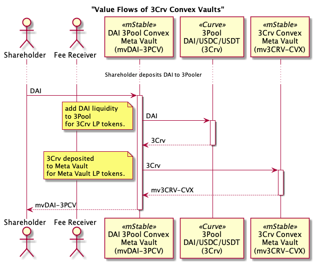
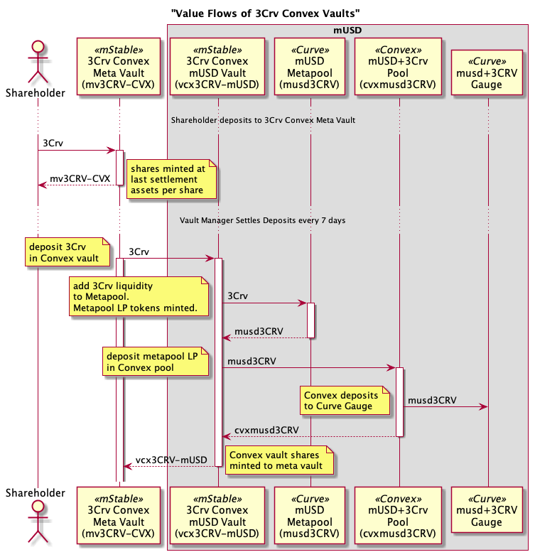
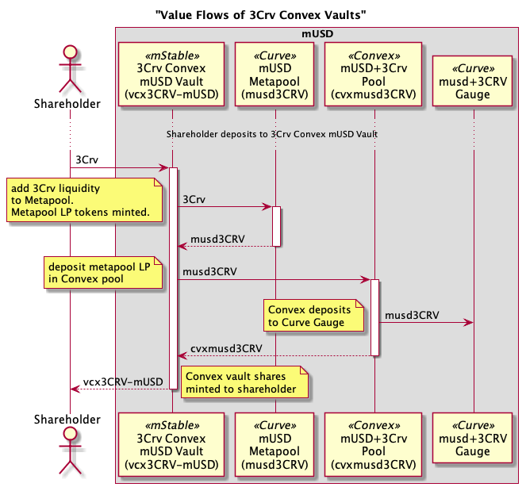
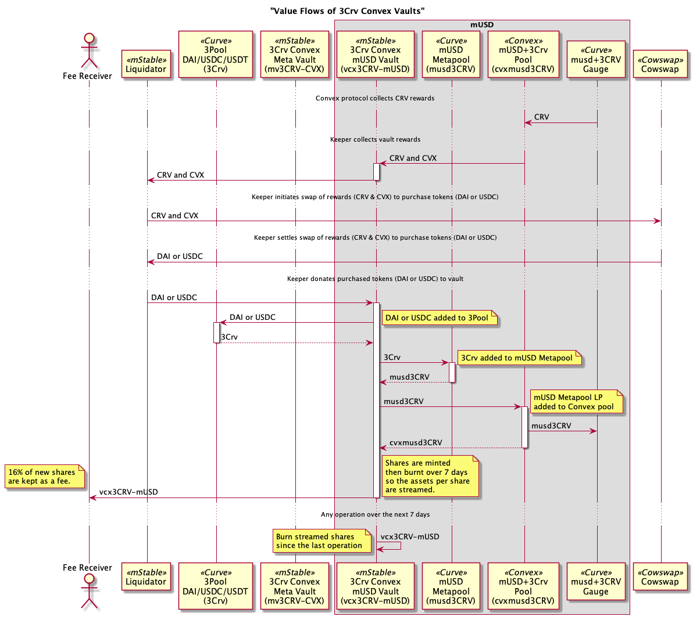
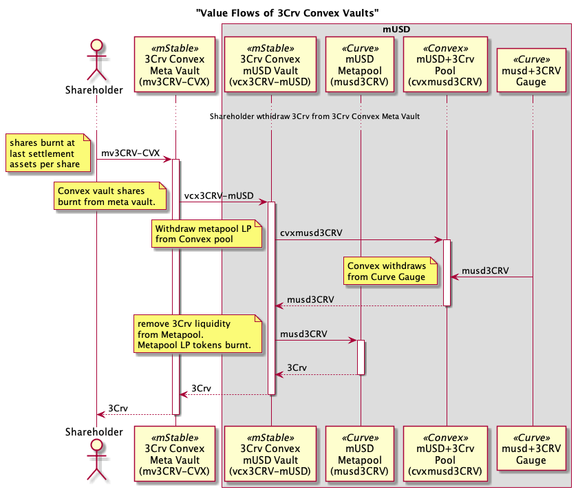

# 3Crv Convex Vaults

The first set of mStable meta vaults are for staking 3Pool-based (3Crv) [Curve](https://curve.fi/) Metapool liquidity provider (LP) tokens in [Convex](https://www.convexfinance.com/). For example, staking Curve's [mUSD3Crv LP token](https://etherscan.io/address/0x1AEf73d49Dedc4b1778d0706583995958Dc862e6) from the [mUSD+Crv pool](https://curve.fi/musd) in Convex's [mUSD pool](https://www.convexfinance.com/stake).

# Contracts

Dependencies

Mainnet Deployment

## DAI/USDC/USDT 3Pool Meta Vaults

Abstract ERC-4626 vaults with DAI, USDC or USDT asset invested in Curve's [3Pool](https://curve.fi/3pool), and then the 3Pool LP token (3Crv) is invested in an underlying 3Pool-based (3Crv) Meta Vault.

-   [Curve Vault Contracts](./contracts/vault/liquidity/curve)
-   Implementing contract [Curve3CrvBasicMetaVault](./contracts/vault/liquidity/curve/Curve3CrvBasicMetaVault.sol)

## Meta Vault of Convex Vaults for 3Pool-based Curve Metapools (3Crv)

ERC-4626 vault with Curve's [3Pool](https://curve.fi/3pool) liquidity provider token (3Crv) as an asset. The 3Crv is invested in underlying Convex 3Crv Basic Vaults.

Deposits of assets (3Crv) are allocated to the underlying vaults based on weights set by the Vault Manager.
Withdraw of assets (3Crv) are proportionally withdrawn from the underlying assets. This may not match the weights set by the Vault Manager.

-   [Meta Vault Contracts](./contracts/vault/meta)
-   Entry contract [PeriodicAllocationPerfFeeMetaVault](./contracts/vault/meta/PeriodicAllocationPerfFeeMetaVault.sol)

## Convex Vault for 3Pool-based Curve Metapools (3Crv)

ERC-4626 vault that deposits Curve 3Pool LP tokens (3Crv) in a Curve 3Pool-based Metapool, eg musd3Crv; deposits the Metapool LP token in a [Convex](https://www.convexfinance.com/) pool; and stakes the Convex LP token, eg cvxmusd3Crv, for CRV and CVX rewards. The Convex rewards are swapped for a Curve 3Pool token, eg DAI, USDC or USDT, using the `Liquidator` module and donated back to the vault. On donation back to the vault, the DAI, USDC or USDT is deposited into the underlying Curve Metapool; the Curve Metapool LP token is deposited into the corresponding Convex pool and the Convex LP token staked.

-   [Convex Vault Contracts](./contracts/vault/liquidity/convex)
-   Implementing contract [Convex3CrvLiquidatorVault](./contracts/vault/liquidity/convex/Convex3CrvLiquidatorVault.sol)

## Liquidator

The [Liquidator](./contracts/vault/liquidator) module is responsible for collecting reward tokens from vaults, swapping them and donating back the purchased tokens to the vaults. For Save+, this is collecting CRV and CVX rewards from the Convex 3Crv Basic Vaults and swapping them for DAI. The Liquidator then donates the DAI back to the Convex 3Crv Basic Vaults.

-   [Liquidator Contracts](./contracts/vault/liquidator)
-   Implementing contract [Liquidator](./contracts/vault/liquidator/Liquidator.sol).

## Swapper

[Swapper](./contracts/vault/swap) contracts are used to swap tokens on-chain. Swaps can be done synchronously via aggregators like [1Inch](https://app.1inch.io/) or Automated Market Makers (AMMs) like [Uniswap](https://uniswap.org/). They can also be done asynchronously with aggregators like [Cowswap](https://cowswap.exchange/).

-   [Swapper Vault Contracts](./contracts/vault/swap)
-   Implementing contracts [CowSwapDex](./contracts/vault/swap/CowSwapDex.sol) and [OneInchDexSwap](./contracts/vault/swap/OneInchDexSwap.sol)

# Value Flows

The high level flow of value (tokens) between contracts. The arrows are the movement of tokens (value) and not contract calls like typical sequence diagrams.

## Deposit DAI to DAI 3Pool Convex Meta Vault

A shareholder deposits DAI into the DAI 3Pool Convex Meta Vault.
The DAI 3Pool Convex Meta Vault adds the DAI to Curve's 3Pool in exchange for the 3Pool Liquidity Provider (LP) token (3Crv).
The DAI 3Pool Convex Meta Vault deposits the 3Crv into the underlying Meta Vault and receives the minted Meta Vault shares (mv3CRV-CVX). Note the underlying Meta Vault does not deposit the 3Crv into any underlying vaults. This is done in a separate settlement transaction by the Vault Manager. 
Finally, the DAI 3Pool Convex Meta Vault mints shares (mvDAI-3PCV) to the shareholder.

## Deposit 3Crv to Meta Vault

A shareholder deposits 3Crv into the Meta Vault and receives vault shares (mv3CRV-CVX). The shares are minted using the assets per share after the last settlement.

Every 5 days, the Vault Manager settles all deposits to the underlying vaults. This can be to a single vault or across all underlying vaults. The vault manager has the discretion at settlement to decide on what proportions of the deposited 3Crv are invested to which underlying vault.

A 5% performance fee is charged on any increase in the meta vault's assets per share. The new assets per share is stored for the next 5 days of deposits and calculating the performance fee at the next settlement.
No performance fee is charged if the assets per share drops. The lower assets per share will be saved and used when charing the next performance fee.

The performance fee is charged by minting new meta vault shares to the vault's fee receiver. The amount of shares minted ensures all shareholder's assets per share increases by the increase in the underlying assets less the performance fee.

## Deposit to 3Crv Convex mUSD Vault

Shareholders can deposit directly to the Convex vault. They do not have to go through the Meta Vault.

## Liquidation of Rewards

The Vault Manager executes a number of transactions to collect the rewards (CRV and CVX) from the Convex Basic Vaults, swap them for DAI, donate the DAI back to the vaults which then streams the increase in assets per share over a day period.

## Rebalance of Meta Vault

The Vault Manager can specify a swap between underlying vaults including the shares or assets amount, the underlying vault to withdraw from and the vault the assets should be deposited into. Multiple swaps can be done in the one rebalance transaction.

The below example the Vault Manager partially swaps investment in the Convex 3Crv Meta Vault (mv3CRV-CVX) from the Convex mUSD Vault (vcv3CRV-mUSD) to the Convex FRAX Vault (vcv3CRV-FRAX).

## Withdraw 3Crv from Meta Vault

A shareholder withdraws 3Crv from Meta Vault in exchange for vault shares (mv3CRV-CVX).

If there are any assets in the meta vault from recent deposits waiting settlement, these will be used for the withdraw.

If there is not enough assets in the meta vault to cover the withdraw, the required assets are sourced from the underlying vaults.

The below diagram shows the 3Crv is withdrawn form just one underlying Convex Vault. A single underlying vault is used if the asset withdraw amount is less than 10% of the meta vault's total assets. If it withdrawn assets is great than 10%, then the required assets are withdrawn proportionally from the underlying vaults.

