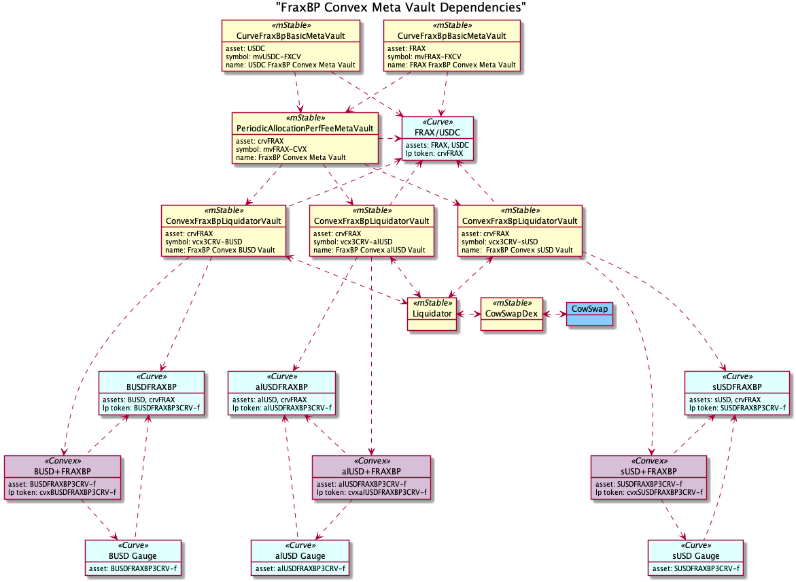
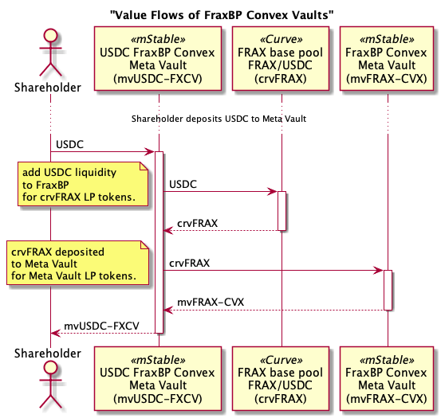
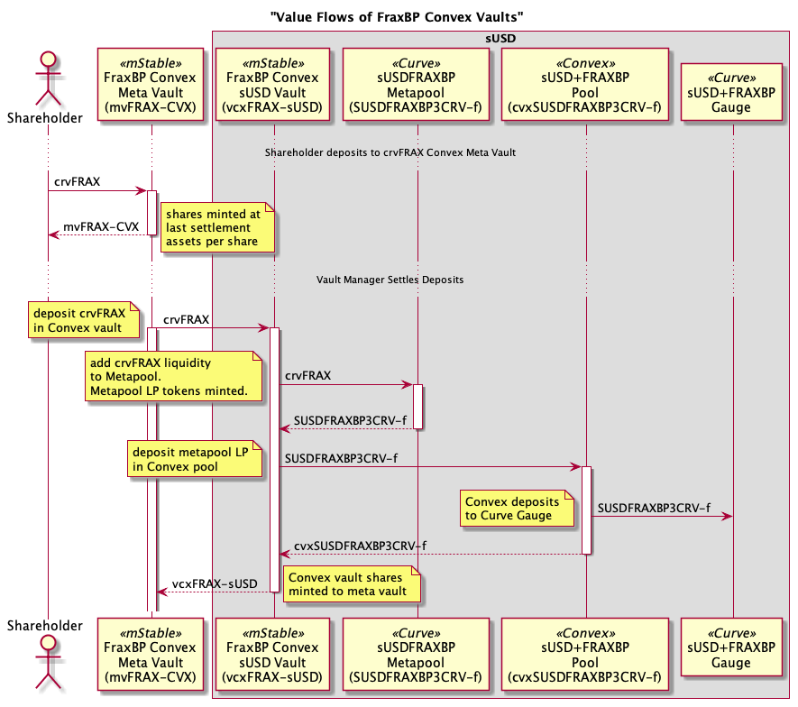
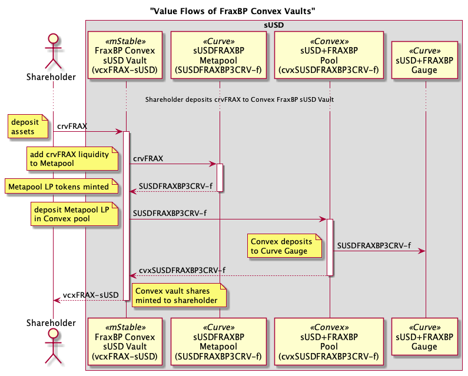
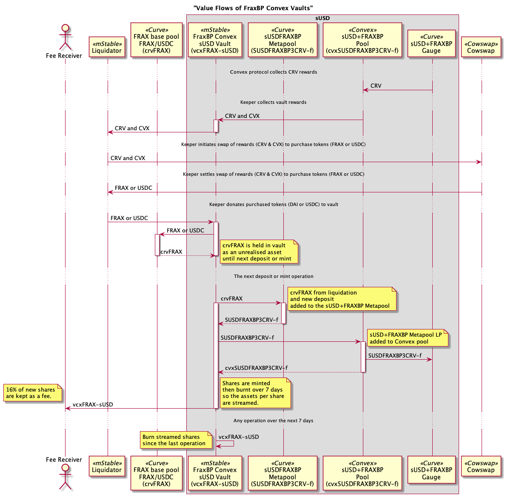
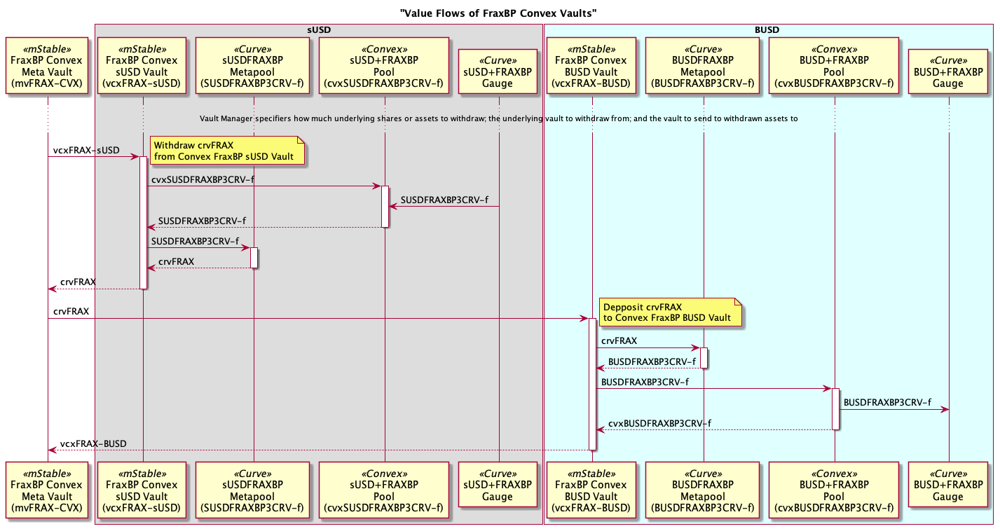
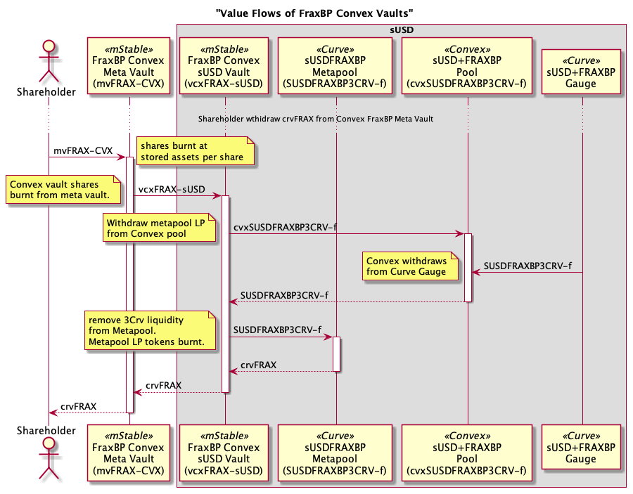
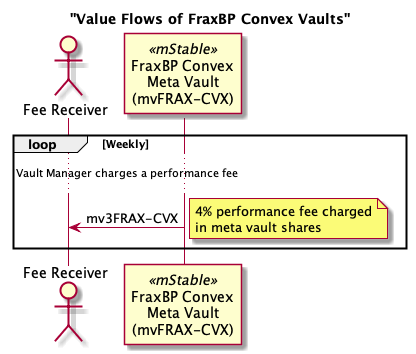

# FRAX based Convex Vaults

The second set of mStable meta vaults are for staking FRAX based [Curve](https://curve.fi/) Metapool liquidity provider (LP) tokens in [Convex](https://www.convexfinance.com/). That is, Metapools that include the FRAX+USDC (crvFRAX) LP token which is also referred to as the Frax base pool (FraxBP).
For example, staking Curve's [sUSDFRAXBP LP token](https://etherscan.io/address/0xe3c190c57b5959ae62efe3b6797058b76ba2f5ef) from Curve's [sUSDFRAXBP pool](https://classic.curve.fi/factory/136) in Convex's [sUSD+FRAX pool](https://www.convexfinance.com/stake).

The first set of mStable meta vaults were staking 3Pool-based (3Crv) [Curve](https://curve.fi/) Metapool liquidity provider (LP) tokens in [Convex](https://www.convexfinance.com/). See [3Crv Convex Vaults](./3CrvConvexVaults.md) for more details.

# Contracts

Dependencies

## Vault with USDC or FRAX asset investing in the Convex FraxBP Meta Vault

Abstract ERC-4626 vaults with USDC or FRAX asset invested in Curve's [FRAX/USDC pool](https://classic.curve.fi/fraxusdc), and then the FRAX+USDC LP token (crvFRAX) is invested in an underlying FRAX-based (crvFRAX) Meta Vault.

-   [Curve FraxBP Vault Contracts](./contracts/vault/liquidity/curve)
-   Implementing contract [CurveFraxBpBasicMetaVault](./contracts/vault/liquidity/curve/CurveFraxBpBasicMetaVault.sol)

## Meta Vault of Convex FraxBP Vaults

ERC-4626 vault with Curve's [FRAX/USDC pool](https://classic.curve.fi/fraxusdc) liquidity provider token (crvFRAX) as an asset. The crvFRAX is invested in underlying Convex FraxBP Vaults.

Deposits of assets (crvFRAX) are allocated to the underlying vaults based on weights set by the Vault Manager.
Withdraw of assets (crvFRAX) are proportionally withdrawn from the underlying assets. This may not match the weights set by the Vault Manager.

-   [Meta Vault Contracts](./contracts/vault/meta)
-   Entry contract [PeriodicAllocationPerfFeeMetaVault](./contracts/vault/meta/PeriodicAllocationPerfFeeMetaVault.sol)

## Convex FraxBP Vaults

ERC-4626 vault that deposits Curve FRAX+USDC LP tokens (crvFRAX) in a Curve FRAX-based Metapool, eg sUSDFRAXBP; deposits the Metapool LP token in a [Convex](https://www.convexfinance.com/) pool; and stakes the Convex LP token, eg cvxSUSDFRAXBP3CRV-f, for CRV and CVX rewards. The Convex rewards are swapped for FRAX or USDC using the `Liquidator` module and donated back to the vault. On donation back to the vault, the FRAX or USDC is deposited into the FRAX/USDC pool for crvFRAX; the crvFRAX is deposited into the underlying Curve Metapool; the Curve Metapool LP token is deposited into the corresponding Convex pool and the Convex LP token staked.

-   [Convex FraxBP Vault Contracts](./contracts/vault/liquidity/convex)
-   Implementing contract [ConvexFraxBpLiquidatorVault](./contracts/vault/liquidity/convex/ConvexFraxBpLiquidatorVault.sol)

## Liquidator

The [Liquidator](./contracts/vault/liquidator) module is responsible for collecting reward tokens from vaults, swapping them and donating back the purchased tokens to the vaults. For Save+, this is collecting CRV and CVX rewards from the Convex FraxBP Vaults and swapping them for FRAX. The Liquidator then donates the FRAX back to the Convex FraxBP Vaults.

-   [Liquidator Contracts](./contracts/vault/liquidator)
-   Implementing contract [Liquidator](./contracts/vault/liquidator/Liquidator.sol).

## Swapper

[Swapper](./contracts/vault/swap) contracts are used to swap tokens on-chain. Swaps can be done synchronously via aggregators like [1Inch](https://app.1inch.io/) or Automated Market Makers (AMMs) like [Uniswap](https://uniswap.org/). They can also be done asynchronously with aggregators like [Cowswap](https://cowswap.exchange/).

-   [Swapper Vault Contracts](./contracts/vault/swap)
-   Implementing contracts [CowSwapDex](./contracts/vault/swap/CowSwapDex.sol) and [OneInchDexSwap](./contracts/vault/swap/OneInchDexSwap.sol)

# Value Flows

The high level flow of value (tokens) between contracts. The arrows are the movement of tokens (value) and not contract calls like typical sequence diagrams.

## Deposit USDC to FraxBP Convex Meta Vault

A shareholder deposits USDC into the USDC FraxBP Convex Meta Vault.
The USDC vault adds the USDC to Curve's FRAX/USDC pool in exchange for the FRAX/USDC Liquidity Provider (LP) token (crvFRAX).
The USDC vault deposits the crvFRAX into the underlying Meta Vault and receives the minted Meta Vault shares (mvFRAX-CVX). Note the underlying Meta Vault does not deposit the crvFRAX into any underlying vaults. This is done in a separate settlement transaction by the Vault Manager. 
Finally, the vault mints shares (mvUSDC-FXCV) to the shareholder.

## Deposit crvFRAX to Meta Vault

A shareholder deposits crvFRAX into the Meta Vault and receives vault shares (mvFRAX-CVX). The shares are minted using the assets per share after the last settlement.

When there's enough crvFRAX in the Meta Vault and it's gas efficient, the Vault Manager settles the deposits to the underlying vaults. This can be to a single vault or across all underlying vaults. The vault manager has the discretion at settlement to decide on what proportions of the deposited crvFRAX are invested to which underlying vault. They can also leave some crvFRAX in the Meta Vault for small withdrawals.

## Deposit to FraxBP Convex sUSD Vault

Shareholders can deposit crvFRAX directly to the FraxBP Convex vaults. They do not have to go through the Meta Vault.

## Liquidation of Rewards

The Vault Manager executes a number of transactions to collect the rewards (CRV and CVX) from the Convex FraxBP Vaults, swap them for FRAX, donate the FRAX back to the vaults which then streams the increase in assets per share over a week period.

## Rebalance of Meta Vault

The Vault Manager can specify a swap between underlying vaults including the shares or assets amount, the underlying vault to withdraw from and the vault the assets should be deposited into. Multiple swaps can be done in the one rebalance transaction.

The below example the Vault Manager partially swaps investment in the Convex FraxBP Meta Vault (mvFRAX-CVX) from the Convex FraxBP sUSD Vault (vcvFRAX-sUSD) to the Convex FraxBP BUSD Vault (vcvFRAX-BUSD).

## Withdraw crvFRAX from Meta Vault

A shareholder withdraws crvFRAX from Meta Vault in exchange for vault shares (mvFRAX-CVX).

If there are any assets in the meta vault from recent deposits waiting settlement, these will be used for the withdraw.

If there is not enough assets in the meta vault to cover the withdraw, the required assets are sourced from the underlying vaults.

The below diagram shows the crvFRAX is withdrawn form just one underlying Convex Vault. A single underlying vault is used if the asset withdraw amount is less than 10% of the meta vault's total assets. If it withdrawn assets is great than 10%, then the required assets are withdrawn proportionally from the underlying vaults.

## Meta Vault Performance Fee

A 4% performance fee is charged on any increase in the meta vault's assets per share every weekly. No performance fee is charged if the assets per share drops. The lower assets per share will be saved and used when charging the next performance fee.

The performance fee is charged by minting new meta vault shares to the vault's fee receiver. The amount of shares minted ensures all shareholder's assets per share increases by the increase in the underlying assets less the performance fee.

