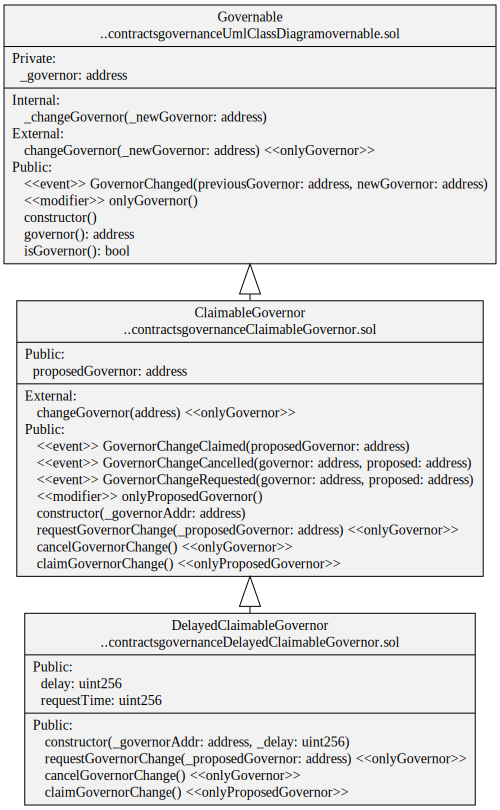

# Governable

## Contracts

-   [Governable](./Governable.sol) Simple contract implementing an [Ownable](https://docs.openzeppelin.com/contracts/2.x/api/ownership#Ownable) pattern.
-   [ClaimableGovernor](./ClaimableGovernor.sol) Two-way handshake for Governance transfer.
-   [DelayedClaimableGovernor](./DelayedClaimableGovernor.sol) After a defined time delay, the proposed Governor can claim governance.

## Diagrams

`DelayedClaimableGovernor` contract

