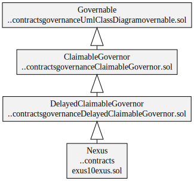
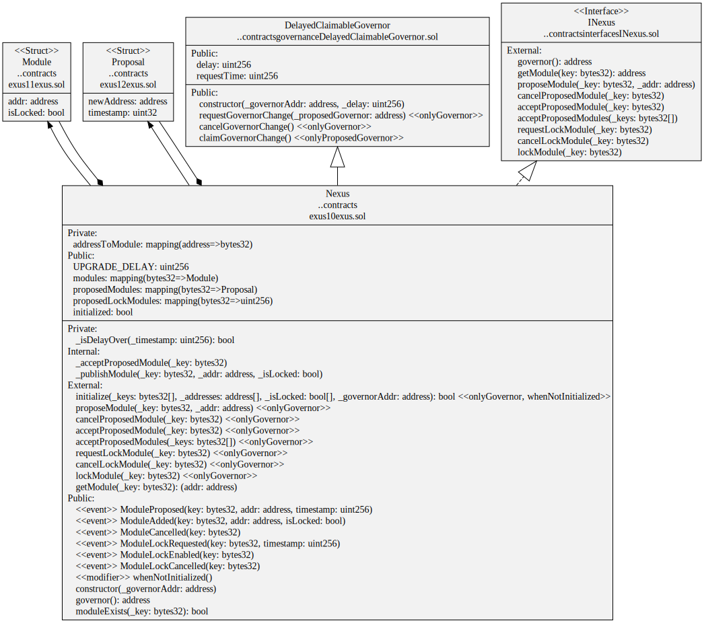

# Nexus

Contract to resolve module names to addresses. Also manages protocol roles like `Governor` and `Keeper`.

## Contracts

-   [Nexus](./Nexus.sol)

## Diagrams

`Nexus` contract hierarchy

`Nexus` contract

`Nexus` storage

## Hardhat tasks

* `nexus-deploy`          Deploys a new Nexus contract
* `nexus-module`          Resolve address of a Nexus module
