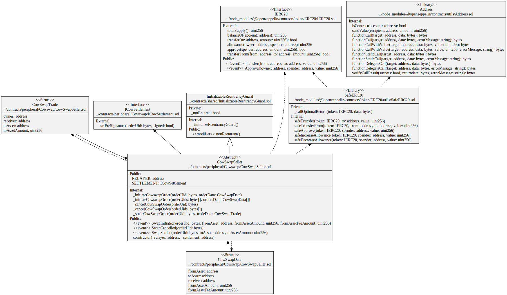

# CowSwap

The [CoW Protocol](https://cow.fi/) lets people swap assets MEV protected at the best exchange rate by leveraging its batch settlement layer built on top of DeFi’s favorite AMMs and DEX Aggregators.

* [Tutorials: Submit orders via the API](https://docs.cow.fi/tutorials/how-to-submit-orders-via-the-api)
* [API Swapper Docs](https://api.cow.fi/docs/#/default/get_api_v1_account__owner__orders)

## Contracts 

* [CowSwapSeller](./CowSwapSeller.sol) sets ERC20 token allowance and presign CowSwap orders.
* [ICowSettlement](./ICowSettlement.sol) Gnosis Protocol v2 Settlement Interface.

## Diagrams

`CowSwapSeller` contract

