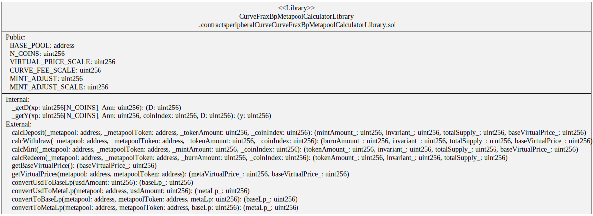

# Curve

[Curve Finance](https://curve.fi) is an on-chain Automated Market Maker (AMM).

Curve Documentation

-   [Plain Pools](https://curve.readthedocs.io/exchange-pools.html#plain-pools). eg [3Pool](https://etherscan.io/address/0xbEbc44782C7dB0a1A60Cb6fe97d0b483032FF1C7)
-   [Metapools](https://curve.readthedocs.io/exchange-pools.html#metapools). eg [mUSD3Crv](https://etherscan.io/address/0x8474DdbE98F5aA3179B3B3F5942D724aFcdec9f6)

# Contracts

-   [Curve3PoolCalculatorLibrary](./Curve3PoolCalculatorLibrary.sol) Library that calculates Curve token amounts including fees for the Curve.fi 3Pool.
-   [Curve3CrvMetapoolCalculatorLibrary](./Curve3CrvMetapoolCalculatorLibrary.sol) Library that calculates Curve liquidity provider token amounts including fees for 3Crv-based Curve.fi Metapools.
-   [Curve3CrvFactoryMetapoolCalculatorLibrary](./Curve3CrvFactoryMetapoolCalculatorLibrary.sol) Calculates Curve liquidity provider token amounts including fees for 3Crv-based Curve.fi factory Metapools.

-   [CurveFraxBpCalculatorLibrary](./CurveFraxBpCalculatorLibrary.sol) Calculates Curve token amounts including fees for FraxBP-based Curve.fi metapools.
-   [CurveFraxBpCalculator](./CurveFraxBpCalculator.sol) wraps `CurveFraxBpCalculatorLibrary` for testing purposes.
-   [CurveFraxBpMetapoolCalculatorLibrary](./CurveFraxBpMetapoolCalculatorLibrary.sol) Calculates Curve liquidity provider token amounts including fees for FraxBp-based Curve.fi metapools.
-   [CurveFraxBpMetapoolCalculator](./CurveFraxBpMetapoolCalculator.sol) wraps `CurveFraxBpetapoolCalculatorLibrary` for testing purposes.

# Diagrams

`Curve3PoolCalculatorLibrary` contract


`Curve3CrvMetapoolCalculatorLibrary` contract


`CurveFraxBpCalculatorLibrary` contract


`CurveFraxBpMetapoolCalculatorLibrary` contract



# Tests

Fork tests of the calculation libraries

```
yarn test:file:fork ./test-fork/peripheral/Curve/Curve3PoolCalculations.spec.ts
yarn test:file:fork ./test-fork/peripheral/Curve/Curve3CrvMetapoolCalculations.spec.ts
```

Fork tests of the Curve 3Pool and metapools

```
yarn test:file:fork ./test-fork/peripheral/Curve/Curve3Pool.spec.ts
yarn test:file:fork ./test-fork/peripheral/Curve/CurveMetapool.spec.ts
```
