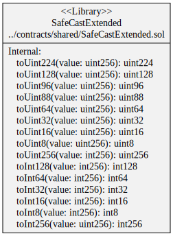

# Shared contracts

Common contracts used by different vaults.

## Diagrams

`VaultManagerRole`, `ImmutableModule` and `ModuleKeys` contracts

`PausableModule` contracts

`SafeCastExtended` contracts

`TokenHolder` contracts

