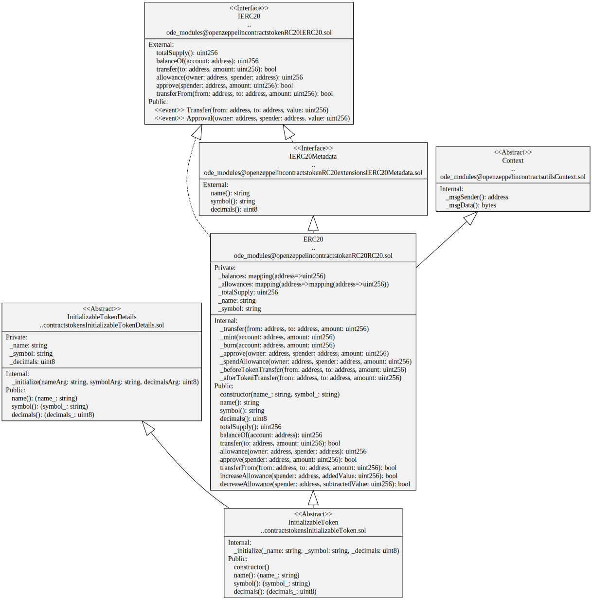

# ERC20 Tokens

Implementations of the [ERC20 Token standard](https://eips.ethereum.org/EIPS/eip-20).

## Contracts

-   [AbstractToken](./AbstractToken.sol) abstracts an ERC-20 token so different implementations can be used by implementing contracts.
-   [InitializableToken](./InitializableToken.sol) Abstract simple token with `name`, `symbol` and `decimals` that is initializable.
-   [InitializableTokenDetails](./InitializableTokenDetails.sol) Token `name`, `symbol` and `decimals` are initializable.

## Diagrams

`InitializableToken` contract

