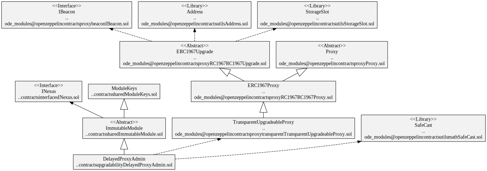
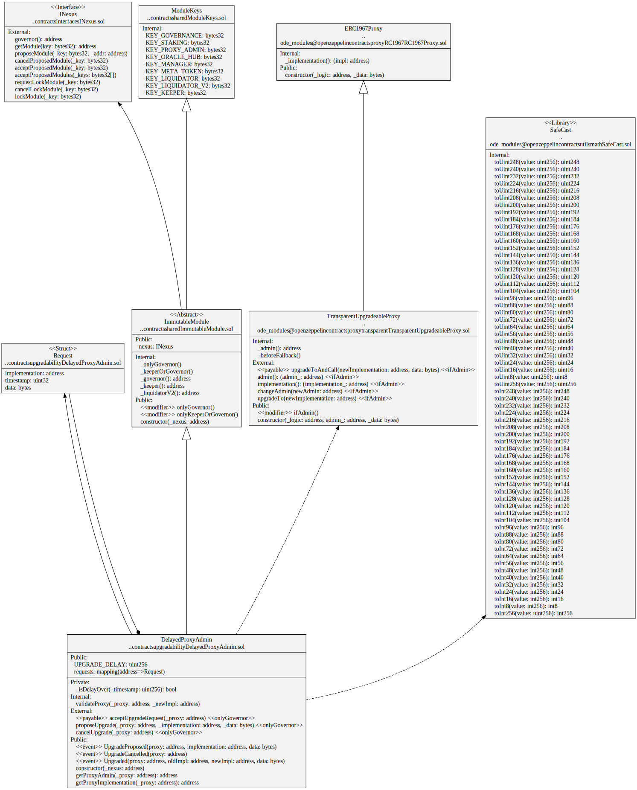
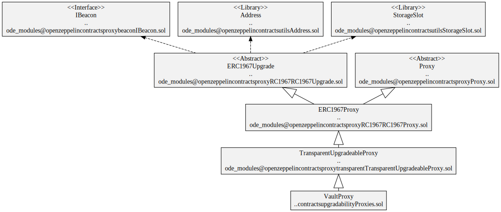
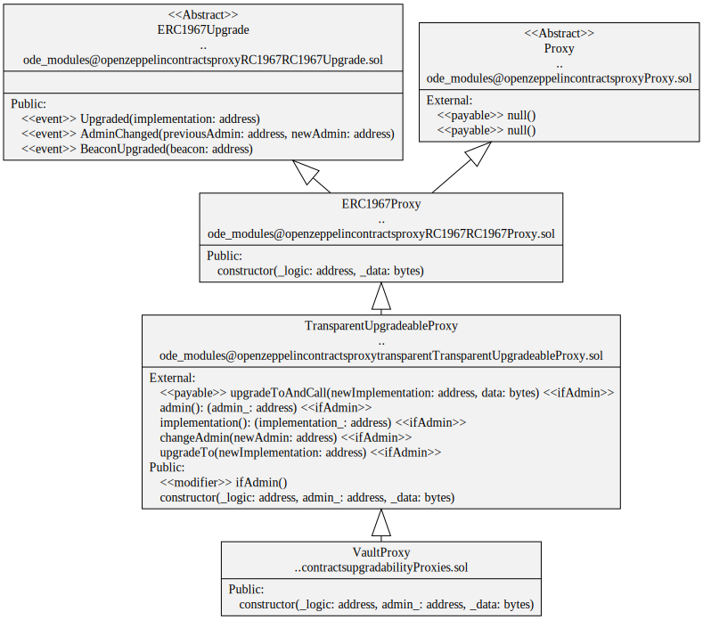

# Upgradability

Contracts that control the changing of proxy contracts to point to new implementations.

## Contracts

* [DelayedProxyAdmin](./DelayedProxyAdmin.sol) Admin for proxy contracts. The Governor can propose a new implementation. After 1 week, the upgrade request can be accepted. The upgrade can be cancelled by the Governor at any time.
* [InstantProxyAdmin](./InstantProxyAdmin.sol) Admin for proxy contracts with no time delay. The Governor can change the proxy's implementation at any time.
* [VaultProxy](./Proxies.sol) delegates contract calls to contract implementations.

## Diagrams

### DelayedProxyAdmin

`DelayedProxyAdmin` hierarchy

`DelayedProxyAdmin` contract

`DelayedProxyAdmin` storage

### InstantProxyAdmin

`InstantProxyAdmin` hierarchy

### VaultProxy

`VaultProxy` hierarchy

`VaultProxy` contract

