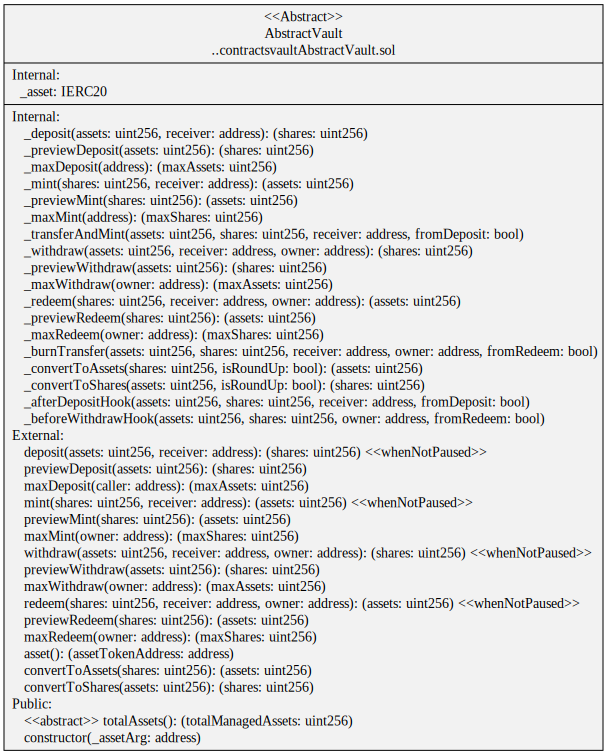

# Vaults

## Vault Interfaces

### ERC-4626 Tokenized Vault Standard

[ERC-4626](https://eips.ethereum.org/EIPS/eip-4626) is a standard for tokenized Vaults with a single underlying ERC-20 token. Note there is only a single asset in the deposit and withdraw functions.

It's possible for the vault to have different underlying assets if the `deposit` function converts the single reference asset to the different underlying assets. Similarly, the `withdraw` functions converts the different underlying assets back to the vault's reference asset.

[IERC4626Vault](../interfaces/IERC4626Vault.sol) Solidity interface.

#### ERC-4626 compliant

-   `asset` returns the vault's reference asset which values all other underlying assets.
-   `totalAssets` and `assetsOf` return the value of the underlying assets in terms of the reference asset.

#### Not ERC-4626 compliant

-   `deposit`, `withdraw` and `convertToShares` take an array of underlying asset token amounts.
-   `mint`, `redeem` and `convertToAssets` return an array of underlying asset token amounts.

#### Additional functions

-   `underlyingAssets` and `totalUnderlyingAssets` get the underlying asset token addresses and amounts in the vault.
-   `underlyingAssetsOf` returns the owner's share of the underlying assets.
-   `totalAssets`

[IMultiAssetVault](../interfaces/IMultiAssetVault.sol) Solidity interface.

## Vault Abstractions

The vaults follow the Open Zeppelin pattern of all the external function calling an internal function that can be overridden by implementing contracts. For examples, the external `deposit` function calls the internal, virtial `_deposit` function that can be overridden with inheritance.

### Abstract EIP-4626 Vault

[AbstractVault](./AbstractVault.sol) implements the [IERC4626Vault](../interfaces/IERC4626Vault.sol) interface.

The following functions need to be implemented:

-   `totalAssets` that returns the total amount of the underlying assets that is managed by vault.
-   `_afterDepositHook` called after assets have been transferred into the vault but before shares are minted. Typically, this deposit the assets into the underlying vaults or platforms.
-   `_beforeWithdrawHook` called before shares are burnt and assets are transferred to the receiver. Typically, this withdraws the assets from the underlying vaults or platforms.

## Vault Capabilities

-   [Asset Allocation Vaults](./allocate/README.md) allocates assets in a multi asset vault.
-   [Fee Vaults](./fee/README.md) collect various fees for multiple parties. For example, transaction, performance and management fees.
-   [Liquidity Vaults](./liquidity/README.md) provide liquidity to Automated Market Makers (AMM) to earn yield. For example, [Uniswap](https://docs.uniswap.org/), [Curve](https://curve.readthedocs.io/) or [Convex](https://docs.convexfinance.com/convexfinance/).
-   [Reward Vaults](./rewards/README.md) adds the capabilities to farm rewards from a vault's asset investments.
-   [Swap Vaults](./swap/README.md) can swap underlying assets of a multi-asset vault. This is used for rebalancing a vault's underlying assets. Swaps can be done via aggregators like 1Inch or AMMs like Uniswap.
-   [Valuation Vaults](./value/README.md) value different assets in a multi-asset vault back to a reference asset. This can be done using an Oracle or Automated Market Maker (AMM).
