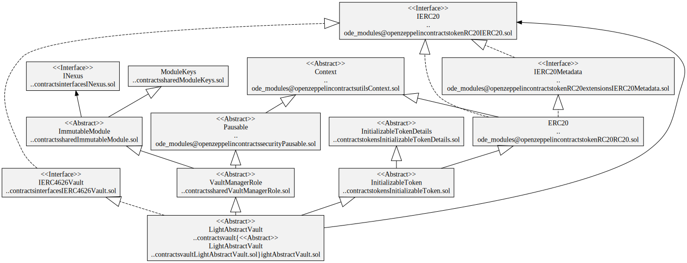

# Vaults

## Vault Interfaces

### ERC-4626 Tokenized Vault Standard

[ERC-4626](https://eips.ethereum.org/EIPS/eip-4626) is a standard for tokenized Vaults with a single underlying ERC-20 token. Note there is only a single asset in the deposit and withdraw functions.

[IERC4626Vault](../interfaces/IERC4626Vault.sol) Solidity interface.

## Vault Abstractions

The vaults follow the Open Zeppelin pattern of all the external functions calling an internal function that can be overridden by implementing contracts. For example, the external `deposit` function calls the internal, virtual `_deposit` function that can be overridden with inheritance.

### Abstract EIP-4626 Vault

[AbstractVault](./AbstractVault.sol) implements the [IERC4626Vault](../interfaces/IERC4626Vault.sol) interface with Pausable flow methods - deposit, mint, redeem and withdraw.

The following functions need to be implemented:

-   `totalAssets` that returns the total amount of the underlying assets that is managed by vault.
-   `_afterDepositHook` called after assets have been transferred into the vault but before shares are minted. Typically, this deposits the assets into the underlying vaults or platforms.
-   `_beforeWithdrawHook` called before shares are burnt and assets are transferred to the receiver. Typically, this withdraws the assets from the underlying vaults or platforms.

`AbstractVault` hierarchy

`AbstractVault` contract

### Light Abstract EIP-4626 Vault

[LightAbstractVault](./LightAbstractVault.sol) is a minimal abstract implementation of an ERC-4626 vault.

`LightAbstractVault` hierarchy

`LightAbstractVault` contract

## Vault Capabilities

-   [Asset Allocation Vaults](./allocate/README.md) allocates assets in a multi asset vault.
-   [Fee Vaults](./fee/README.md) collect various fees for multiple parties. For example, transaction, performance and management fees.
-   [Liquidator](./liquidator/) is responsible for collecting reward tokens from vaults, swapping them and donating back the purchased tokens to the vaults.
-   [Liquidity Vaults](./liquidity/README.md) provide liquidity to Automated Market Makers (AMM) to earn yield. For example, [Uniswap](https://docs.uniswap.org/), [Curve](https://curve.readthedocs.io/) or [Convex](https://docs.convexfinance.com/convexfinance/).
-   [Swap Vaults](./swap/README.md) can swap underlying assets in a Meta Vault. This is used for rebalancing a vault's underlying assets. Swaps can be done via aggregators like 1Inch or AMMs like Uniswap.
-   [Meta Vaults](./meta/) vaults that invest in underlying ERC-4626 vaults.

Note: All vaults have deposit, mint, redeem, withdraw as pausable.
