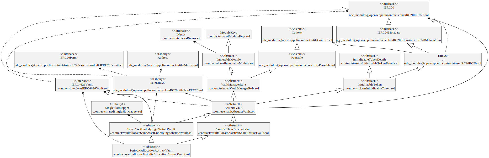
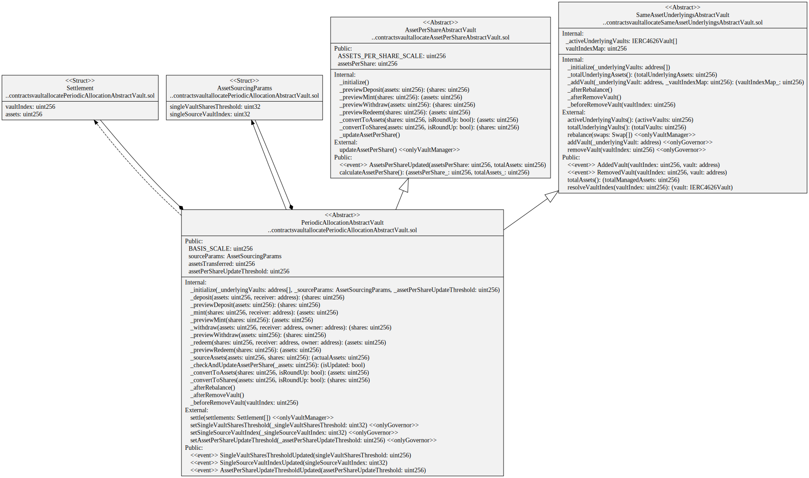

# Asset Allocation Vaults

Allocates assets in an ERC-4626 and multi-asset vaults.

# Contracts

-   [AssetPerShareAbstractVault](./AssetPerShareAbstractVault.sol) Abstract vault that stores assets per share.
-   [SameAssetUnderlyingsAbstractVault](./SameAssetUnderlyingsAbstractVault.sol) Abstract ERC-4626 vault that invests in underlying ERC-4626 vaults of the same asset.
-   [PeriodicAllocationAbstractVault](./PeriodicAllocationAbstractVault.sol) Abstract ERC-4626 vault that periodically invests in underlying ERC-4626 vaults of the same asset.

# Diagrams

## PeriodicAllocationAbstractVault

`PeriodicAllocationAbstractVault` hierarchy



`PeriodicAllocationAbstractVault` contract



`PeriodicAllocationAbstractVault` storage


## Tests

Unit tests

```
yarn test ./test/vault/allocate/PeriodicAllocationBasicVault.spec.ts
yarn test ./test/vault/allocate/SameAssetUnderlyingsBasicVault.spec.ts
```
