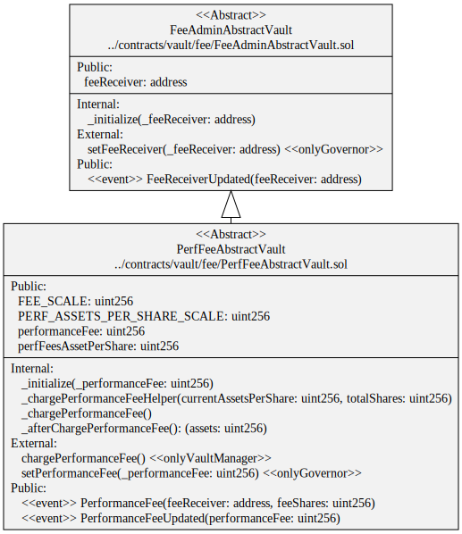

# Fee Vaults

Fee vaults collect various fees for multiple parties. For example, transaction, performance and management fees.

# Contracts

-   [PerfFeeAbstractVault](./PerfFeeAbstractVault.sol) Abstract ERC-4626 vault that calculates a performance fee between investment of deposited assets into underlying platforms/vaults.
-   [PerfFeeBasicVault](./PerfFeeBasicVault.sol) A simple implementation of the abstract performance fee vault for testing purposes.

# Diagrams

## Performance Fee

`PerfFeeBasicVault` hierarchy

`PerfFeeAbstractVault` contract

`PerfFeeAbstractVault` storage

# Tests

Unit tests

`yarn test ./test/vault/fees/*.spec.ts`
