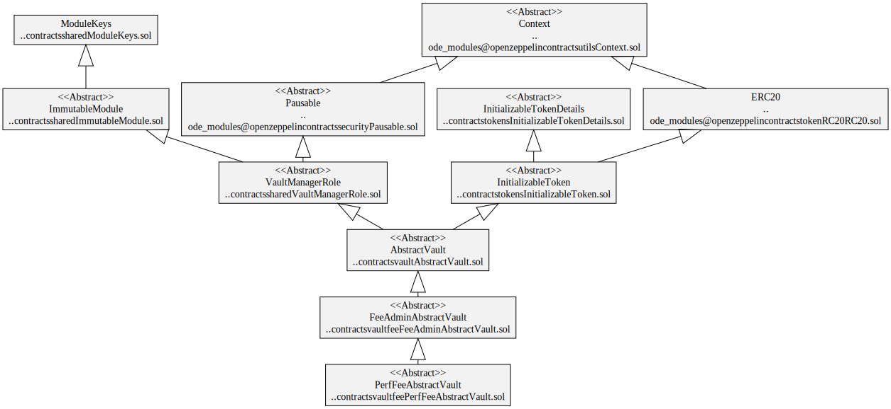

# Fee Vaults

Fee vaults collect various fees for multiple parties. For example, transaction, performance and management fees.

# Contracts

-   [PerfFeeAbstractVault](./PerfFeeAbstractVault.sol) Abstract ERC-4626 vault that calculates a performance fee between investment of deposited assets into underlying platforms/vaults.
-   [PerfFeeBasicVault](./PerfFeeBasicVault.sol) A simple implementation of the abstract performance fee vault for testing purposes.
-   [ManFeeAbstractVault](./ManFeeAbstractVault.sol) Abstract ERC-4626 vault that calculates a management fee when vault operations are performed.
-   [ManFeeBasicVault](./ManFeeBasicVault.sol) A simple implementation of the abstract management fee vault for testing purposes.
-   [TxFeeAbstractVault](./TxFeeAbstractVault.sol) Abstract ERC-4626 vault that charges transaction fees to a single recipient.
-   [TxFeeBasicVault](./TxFeeAbstractVault.sol) Basic implementation `TxFeeAbstractVault` for testing purposes.

# Diagrams

## Performance Fee

`PerfFeeBasicVault` hierarchy

`PerfFeeAbstractVault` contract

`PerfFeeAbstractVault` storage

## Management Fee

`ManFeeAbstractVault` hierarchy

`ManFeeAbstractVault` contract

`ManFeeAbstractVault` storage

## Transaction Fee

`TxFeeAbstractVault` hierarchy

`TxFeeAbstractVault` contract

`TxFeeAbstractVault` storage

# Tests

Unit tests

`yarn test ./test/vault/fees/*.spec.ts`
