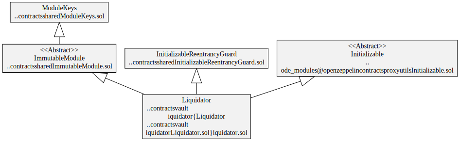
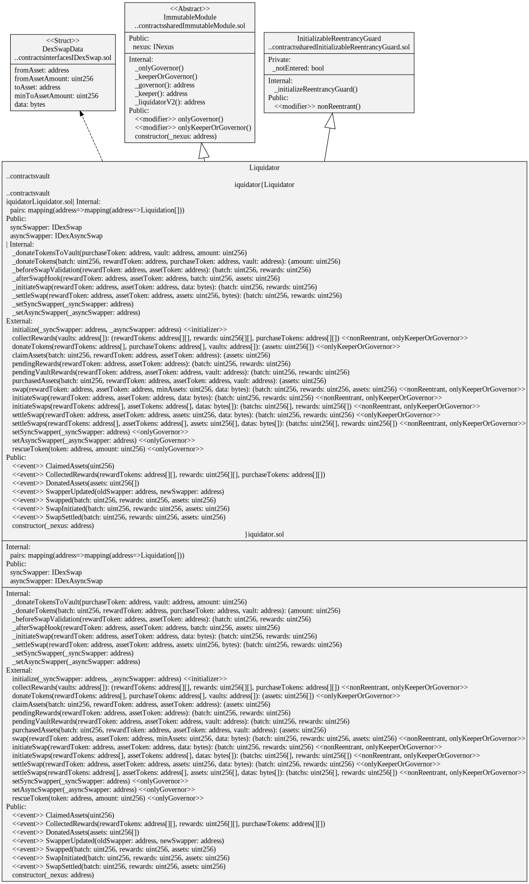
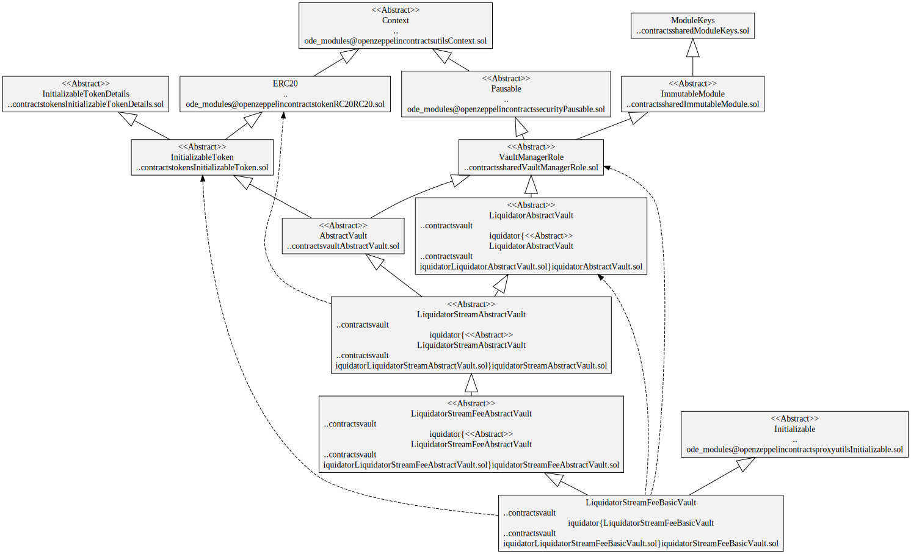
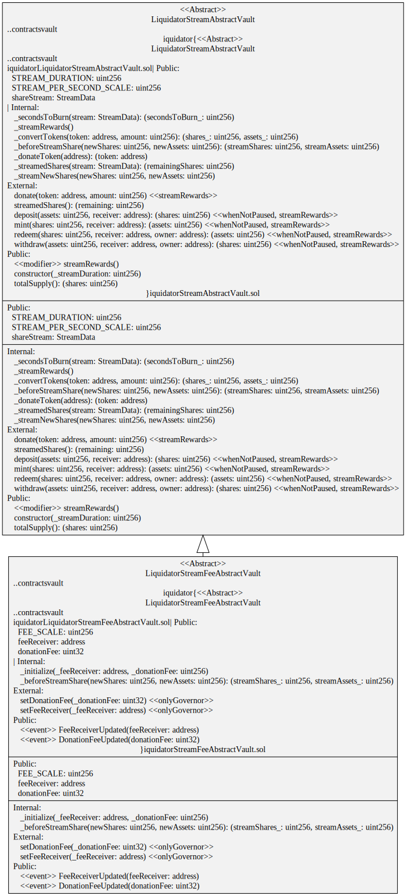

# Liquidator

The Liquidator module is responsible for collecting reward tokens from vaults, swapping them and donating back the purchased tokens to the vaults. Typically, this is swapping reward tokens to vault assets which are donated back to the vaults to increase their assets per share. For example, swapping $CRV earned in a Curve pool back to a vault asset like $DAI. There can be multiple reward tokens collected from a vault and different target tokens can be specified for each reward token.

The Liquidator's main task is to batch the swapping of rewards collected from multiple vaults. This socializes the gas costs in swapping rewards across multiple vaults.

The Liquidator uses a [Swapper](../swap/README.md) module to do on-chain token swaps. A swapper typically uses a swap aggregator like 1Inch or CowSwap but can use decentralized exchanges like Uniswap or Balancer.

# Contracts

Liquidator contracts that do the token swapping:

-   [Liquidator](./Liquidator.sol) Collects reward tokens from vaults, swaps them and donated the purchased token back to the vaults, swaps can be synchronous or asynchronous implementation of a Liquidator that uses a swapper implementing the [IDexSwap](../../interfaces/IDexSwap.sol#IDexSwap)) interface and [IDexAsyncSwap](../../interfaces/IDexSwap.sol#IDexAsyncSwap) interface.

Vault contracts that interact with the Liquidator:

-   [ILiquidatorVault](../../interfaces/ILiquidatorVault.sol) Interface that the Liquidator uses to interact with on vaults.
-   [LiquidatorAbstractVault](./LiquidatorAbstractVault.sol) Vaults must implement this if they integrate to the Liquidator.
-   [LiquidatorBasicVault](./LiquidatorBasicVault.sol) An implementation of the abstract liquidator vault for testing purposes.
-   [LiquidatorStreamAbstractVault](./LiquidatorStreamAbstractVault.sol) Abstract ERC-4626 vault that streams increases in the vault's assets per share by minting and then burning shares over a period of time.
-   [LiquidatorStreamBasicVault](./LiquidatorStreamBasicVault.sol) An implementation of the abstract liquidator that streams donated assets for testing purposes.
-   [LiquidatorStreamFeeAbstractVault](./LiquidatorStreamFeeAbstractVault.sol) Abstract ERC-4626 vault that streams increases in the vault's assets per share by minting and then burning shares over a period of time. This vault also charges a performance fee on the donated assets by senting a percentage of the streamed shares to a fee receiver.
-   [LiquidatorStreamFeeBasicVault](./LiquidatorStreamFeeBasicVault.sol) An implementation of `LiquidatorStreamFeeAbstractVault` for testing purposes.

# Processes


## Collect Rewards

Anyone can call the Liquidator to collect rewards from a list of vaults. The Liquidator calls each vault to collect their rewards. The vaults transfer the rewards to themselves first and then the Liquidator transfers each reward from each vault to the Liquidator.

Vault rewards can be collect multiple times before they are swapped for the vault asset. It's the responsibility of the Liquidator to account for how many rewards were collected from each vault.

## Swap

A trusted account calls the Liquidator to swap a reward to asset pair. This is executed periodically after the rewards from the vaults have been collected.

## Donate Assets

The protocol Governor or Keeper can send the purchased assets from a batch back to the vaults. Separate transactions are required if a vault has multiple reward tokens.

The vaults then decide what to do with the extra assets.
The simplest is for the vault to just add to the other assets without minting any shares.
This has the effect of increasing the vault's assets per share.

Increasing the assets per share can be a problem if there is a relatively large amount of assets being donated as it can be sandwich attacked.
The attacker can mint a large amount of shares before the donation and then redeem them afterwards taking most of the donated assets.
This can be avoided by streaming the increase of assets per share over time.
For example, minting new shares and then burning them over a period of time. eg one day.

## Claim Assets

An alternative to donate assets is the vault pulls the purchased assets from the Liquidator back to itself.

# Diagrams

## Liquidator

`Liquidator` hierarchy



`Liquidator` contract



`Liquidator` storage


## LiquidatorStreamFeeBasicVault

`LiquidatorStreamFeeBasicVault` hierarchy



`LiquidatorStreamFeeAbstractVault` contract



`LiquidatorStreamFeeAbstractVault` storage


## LiquidatorAbstractVault

`LiquidatorAbstractVault` contract


# Tests

Unit tests

```
yarn test ./test/vault/liquidator/*.spec.ts
```
