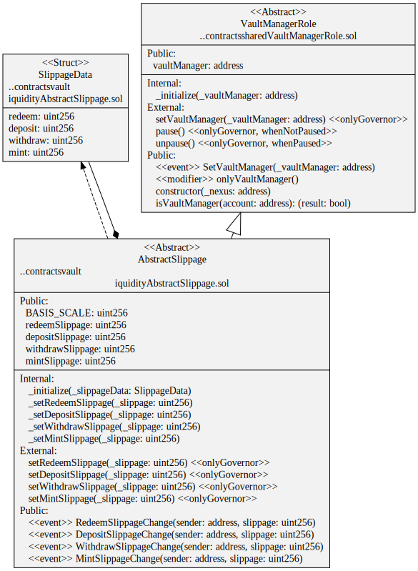

# Liquidity Vaults

Provide liquidity to Automated Market Makers (AMM) to earn yield. For example, [Uniswap](https://docs.uniswap.org/), [Curve](https://curve.readthedocs.io/) or [Convex](https://docs.convexfinance.com/convexfinance/). Convex indirectly provides liquidity to Curve so is included here.

-   [Curve](./curve/README.md)
-   [Convex](./convex/README.md)

# Common Liquidity Contracts

-   [AbstractSlippage](./AbstractSlippage.sol) manages the configuration of slippage limits for mint, deposit, redeem and withdraw.
-   [BasicSlippage](./BasicSlippage.sol) simple implementation of AbstractSlippage for unit testing.

# Diagrams

`AbstractSlippage` contract

# Tests

Unit tests

`yarn test ./test/vault/liquidity/slippage.spec.ts`
