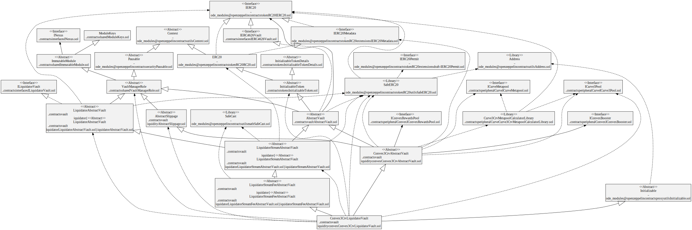
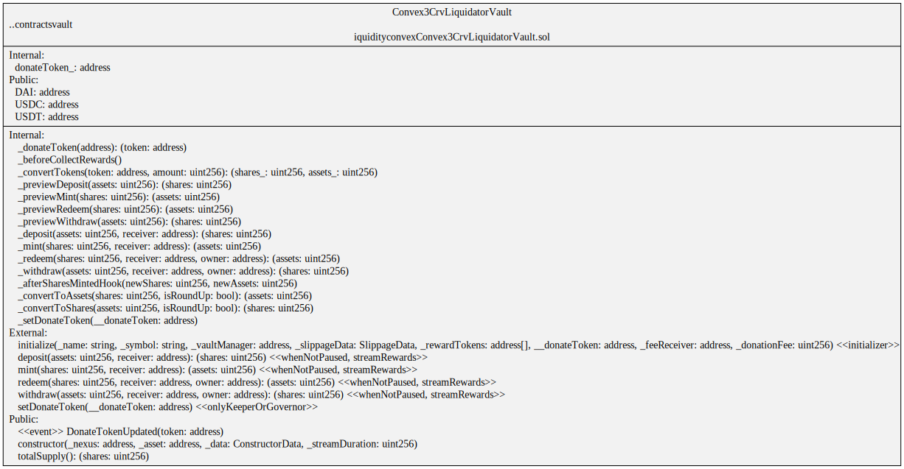
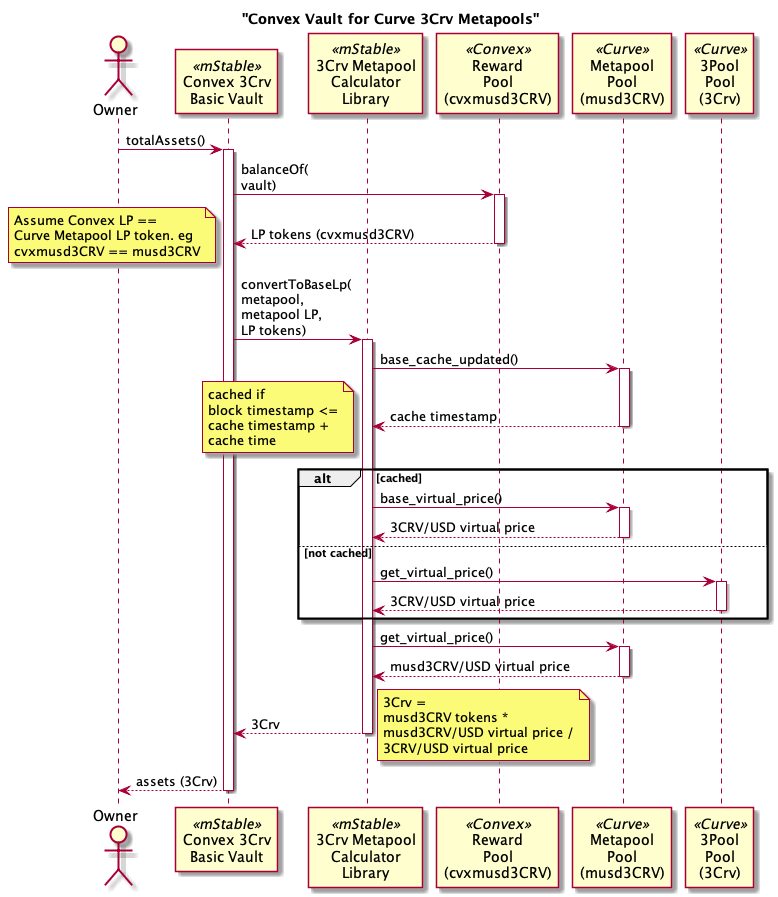

# Convex Liquidity Vaults

Provide liquidity to [Convex](https://docs.convexfinance.com/convexfinance/) pools.

# Contracts

## Convex Vault for 3Pool-based Curve Metapools (3Crv)

Vaults that deposit into a Curve 3Pool (3Crv) based Metapool before depositing the LP token into a Convex pool.

-   [Convex3CrvAbstractVault](./Convex3CrvAbstractVault.sol) abstract ERC-4626 vault with a Curve.fi 3pool (3Crv) asset invested in a Curve Metapool, deposited in a Convex pool and then staked.
-   [Convex3CrvBasicVault](./Convex3CrvBasicVault.sol) basic implementation of `Convex3CrvAbstractVault` used for testing purposes.
-   [Convex3CrvLiquidatorVault](./Convex3CrvLiquidatorVault.sol) ERC-4626 vault that deposits Curve 3Pool LP tokens (3Crv) in a Curve Metapool, eg musd3Crv; deposits the Metapool LP token in Convex; and stakes the Convex LP tokens, eg cvxmusd3Crv, in Convex for CRV and CVX rewards. The Convex rewards are swapped for a Curve 3Pool token, eg DAI, USDC or USDT, using the [Liquidator module](../liquidator/README.md) and donated back to the vault. On donation back to the vault, the DAI, USDC or USDT is deposited into the underlying Curve Metapool; the Curve Metapool LP token is deposited into the corresponding Convex pool and the Convex LP token staked.

# Diagrams

## Convex Vault for 3Pool-based Curve Metapools (3Crv)

`Convex3CrvLiquidatorVault` hierarchy



`Convex3CrvLiquidatorVault` contract



`Convex3CrvLiquidatorVault` storage


`Convex3CrvAbstractVault` contract


# Processes

## Curve 3Pool (3Crv) based Metapools

### Total Assets

Get the total assets (3Crv) in `Convex3CrvAbstractVault`.

Uses the Curve 3Pool and Metapool virtual prices to calculate the value of the vault's assets (3Crv) from the staked Metapool LP tokens in the Convex pool, eg cvxmusd3Crv. This does not include slippage or fees.



### Preview Deposit

Shareholder previews the number of shares returned from a deposit of assets (3Crv) in a `Convex3CrvAbstractVault`.


### Deposit Assets

Shareholder deposits assets (3Crv) in a `Convex3CrvAbstractVault`.


### Preview Mint

Shareholder previews the number of assets (3Crv) required to deposit for an amount of vault share from a `Convex3CrvAbstractVault`.


### Mint shares

Shareholder mints vault shares in exchange for assets (3Crv) in a `Convex3CrvAbstractVault`.


### Redeem shares

Shareholder redeems vault shares in exchange for assets (3Crv) from a `Convex3CrvAbstractVault`.


### Preview Redeem

Shareholder previews the number of assets (3Crv) that will be received from redeeming an amount of vault share from a `Convex3CrvAbstractVault`.


### Withdraw assets

Shareholder withdraws assets (3Crv) in exchange for redeeming vault shares from a `Convex3CrvAbstractVault`.


### Preview Withdraw

Shareholder previews the number of vault shares that will be burnt for withdrawing assets (3Crv) from a `Convex3CrvAbstractVault`.


# Tests

Fork tests

```
export NODE_URL=your provider url
yarn test:file:fork ./test-fork/vault/Convex3CrvBasicVault.spec.ts
yarn test:file:fork ./test-fork/vault/Convex3CrvLiquidatorVault.spec.ts
```
