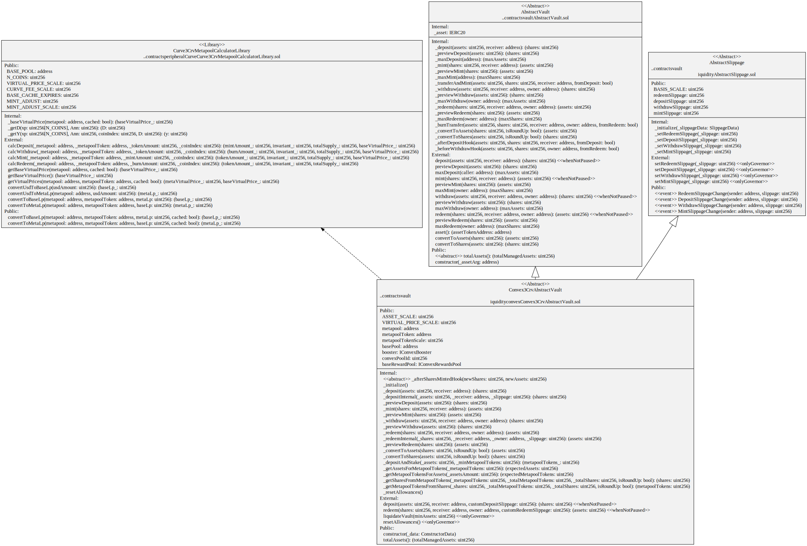
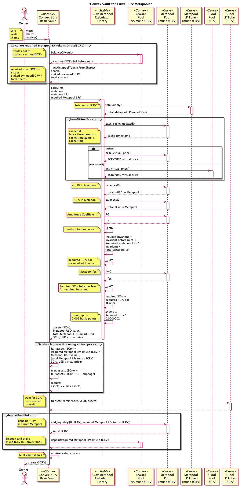
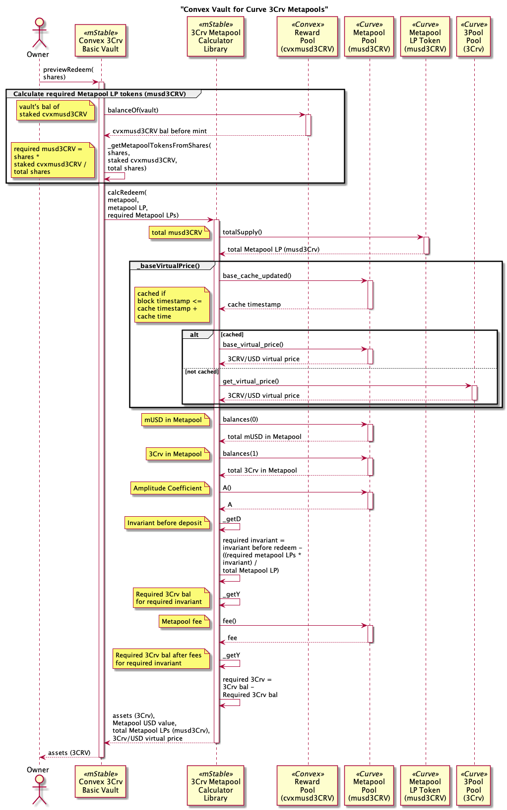

# Convex Liquidity Vaults

Provide liquidity to [Convex](https://docs.convexfinance.com/convexfinance/) pools.

# Contracts

## Convex Vault for 3Pool-based Curve Metapools (3Crv)

Vaults that deposit into a Curve 3Pool (3Crv) based metapool before depositing the LP token into a Convex pool.

-   [Convex3CrvAbstractVault](./Convex3CrvAbstractVault.sol) abstract ERC-4626 vault with a Curve.fi 3pool (3Crv) asset invested in a Curve metapool, deposited in a Convex pool and then staked.
-   [Convex3CrvBasicVault](./Convex3CrvBasicVault.sol) basic implementation of `Convex3CrvAbstractVault` used for testing purposes.
-   [Convex3CrvLiquidatorVault](./Convex3CrvLiquidatorVault.sol) ERC-4626 vault that deposits Curve 3Pool LP tokens (3Crv) in a Curve Metapool, eg musd3Crv; deposits the Metapool LP token in Convex; and stakes the Convex LP tokens, eg cvxmusd3Crv, in Convex for CRV and CVX rewards. The Convex rewards are swapped for a Curve 3Pool token, eg DAI, USDC or USDT, using the [Liquidator module](../liquidator/README.md) and donated back to the vault. On donation back to the vault, the DAI, USDC or USDT is deposited into the underlying Curve Metapool; the Curve Metapool LP token is deposited into the corresponding Convex pool and the Convex LP token staked.

# Diagrams

## Convex Vault for 3Pool-based Curve Metapools (3Crv)

`Convex3CrvLiquidatorVault` hierarchy


`Convex3CrvLiquidatorVault` contract


`Convex3CrvLiquidatorVault` storage


`Convex3CrvAbstractVault` contract



# Processes

## Curve 3Pool (3Crv) based Metapools

### Total Assets

Get the total assets (3Crv) in a `Convex3CrvAbstractVault`.

Uses the Curve 3Pool and Metapool virtual prices to calculate the value of the vault's assets (3Crv) from the staked Metapool LP tokens in the Convex pool, eg cvxmusd3Crv. This does not include slippage or fees.

Steps:

-   Get vault's balance of staked Curve Metapool LP tokens in the Convex rewards pool (cvxmusd3Crv).
-   Get virtual 3CRV price in USD from 3Pool.
-   Get virtual Curve Metapool LP token price in USD from the Curve Metapool. eg musd3Crv.
-   Total assets = Metapool LP tokens \* Metapool LP virtual price in USD / 3Crv virtual price in USD.


### Preview Deposit

Shareholder previews the amount of shares returned from a deposit of assets (3Crv) in a `Convex3CrvAbstractVault`.

Uses the Curve 3Pool and Metapool virtual prices to calculate the minimum shares from depositing an amount of assets using a configured max slippage.

Steps:

-   Calculate min Metapool LP tokens to protect against sandwich attacks using pool virtual prices.
    -   Get virtual 3CRV/USD price from 3Pool.
    -   Get virtual Curve Metapool LP token price in USD from the Curve Metapool. eg musd3Crv.
    -   Metapool LP tokens (musd3Crv) = assets (3Crv) \* 3Crv virtual price in USD / Metapool LP virtual price in USD.
    -   Min Metapool LP tokens (musd3Crv) = Metapool LP tokens (musd3Crv) \* (1 - deposit slippage). Deposit slippage is around 1% or 100 basis points.
-   Get vault's balance of staked Curve Metapool LP tokens in the Convex rewards pool (cvxmusd3Crv) after deposit.
-   Shares = min Metapool LP tokens (musd3Crv) \* total shares / total Metapool LP tokens in the Convex rewards pool.
-   Mint share to the receiver.


### Deposit Assets

Shareholder deposits assets (3Crv) in a `Convex3CrvAbstractVault`.

Steps:

-   Transfer assets (3Crv) from caller to the vault.
-   Get vault's balance of staked Curve Metapool LP tokens in the Convex rewards pool (cvxmusd3Crv) before deposit.
-   Calculate min Metapool LP tokens to protect against sandwich attacks using pool virtual prices.
    -   Get virtual 3CRV/USD price from 3Pool.
    -   Get virtual Curve Metapool LP token price in USD from the Curve Metapool. eg musd3Crv.
    -   Metapool LP tokens (musd3Crv) = assets (3Crv) \* 3Crv virtual price in USD / Metapool LP virtual price in USD.
    -   Min Metapool LP tokens (musd3Crv) = Metapool LP tokens (musd3Crv) \* (1 - deposit slippage). Deposit slippage is around 1% or 100 basis points.
-   Deposit and stake
    -   Add assets (3Crv) to Metapool with min Metapool LP token protection.
    -   Get vault's Metapool LP tokens (musd3Crv) balance in the Metapool.
    -   Deposit all the vault's Metapool LP tokens (musd3Crv) into the Convex pool.
-   Get vault's balance of staked Curve Metapool LP tokens in the Convex rewards pool (cvxmusd3Crv) after deposit.
-   Deposited Curve Metapool LP tokens in the Convex rewards pool = before bal - after bal.
-   Shares = deposited Metapool LP tokens \* total shares / total Metapool LP tokens in the Convex rewards pool.
-   Mint share to the receiver.


### Preview Mint

Shareholder previews the amount of assets (3Crv) required to deposit for an amount of vault share from a `Convex3CrvAbstractVault`.

Steps:

-   Calculate required Curve Metapool LP tokens (musd3Crv) to mint shares
    -   Get vault's balance of staked Curve Metapool LP tokens in the Convex rewards pool (cvxmusd3Crv).
    -   shares = shares \* total cvxmusd3CRV / total shares
-   Calculate max assets (3Crv) to protect against sandwich attacks using pool virtual prices.
    -   Get virtual 3CRV/USD price from 3Pool.
    -   Get virtual Curve Metapool LP token price in USD from the Curve Metapool. eg musd3Crv.
    -   Assets (3CRV) from virtual prices = required Curve Metapool LP tokens (musd3Crv) \* musd3CRV/USD price / 3CRV/USD price
    -   Max assets (3CRV) = assets (3CRV) from virtual prices \* (1 - mint slippage). Mint slippage is around 0.1% or 10 basis points.
-   Calculate actual assets (3Crv) for required Metapool LP tokens.
    -   Calculate 3Crv from withdraw of required Metapool LP tokens.
    -   Estimate 3Crv deposit amount from 3Crv withdraw amount.
    -   Get Metapool admin fee and token balances.
    -   Calculate Metapool LP tokens from estimated assets (3Crv)
        -   Adjust up assets (3Crv) for `calc_token_amount` which is inaccurate.
        -   Calculate Metapool LP tokens using adjusted assets (3Crv).
        -   if Metapool LP tokens calculated < required, increase estimated assets (3Crv) by 0.1% and repeat previous two steps.


### Mint shares

Shareholder mints vault shares in exchange for assets (3Crv) in a `Convex3CrvAbstractVault`.

Calculates the required number of Metapool LP tokens needed for the requested number of shares. Estimates the minimum amount of assets for the required number of Metapool LP tokens using the Metapool's token balances. Sandwich protection is done by calculating the maximum assets using a configured max mint slippage from an assets amount calculated from the Curve 3Pool and Metapool virtual prices.

Steps:

-   Calculate required Curve Metapool LP tokens (musd3Crv) to mint shares
    -   Get vault's balance of staked Curve Metapool LP tokens in the Convex rewards pool (cvxmusd3Crv).
    -   shares = shares \* total cvxmusd3CRV / total shares
-   Calculate max assets (3Crv) to protect against sandwich attacks using pool virtual prices.
    -   Get virtual 3CRV/USD price from 3Pool.
    -   Get virtual Curve Metapool LP token price in USD from the Curve Metapool. eg musd3Crv.
    -   Assets (3CRV) from virtual prices = required Curve Metapool LP tokens (musd3Crv) \* musd3CRV/USD price / 3CRV/USD price
    -   Max assets (3CRV) = assets (3CRV) from virtual prices \* (1 - mint slippage). Mint slippage is around 0.1% or 10 basis points.
-   Calculate actual assets (3Crv) for required Metapool LP tokens.
    -   Calculate 3Crv from withdraw of required Metapool LP tokens.
    -   Estimate 3Crv deposit amount from 3Crv withdraw amount.
    -   Get Metapool admin fee and token balances.
    -   Calculate Metapool LP tokens from estimated assets (3Crv)
        -   Adjust up assets (3Crv) for `calc_token_amount` which is inaccurate.
        -   Calculate Metapool LP tokens using adjusted assets (3Crv).
        -   if Metapool LP tokens calculated < required, increase estimated assets (3Crv) by 0.1% and repeat previous two steps.
-   Transfer assets (3Crv) from caller to the vault.
-   Deposit and stake
    -   Add assets (3Crv) to Metapool with min Metapool LP token protection.
    -   Get vault's Metapool LP tokens (musd3Crv) balance in the Metapool.
    -   Deposit all the vault's Metapool LP tokens (musd3Crv) into the Convex pool.
-   Mint share to the receiver.



### Redeem shares

Shareholder redeems vault shares in exchange for assets (3Crv) from a `Convex3CrvAbstractVault`.

Steps:

-   Get vault's balance of staked Convex pool LP tokens (cvxmusd3CRV).
-   Calculate required Metapool LP tokens (musd3CRV) = shares \* Convex pool LP token balance (cvxmusd3CRV) / total shares.
-   Calculate min assets (3Crv) to protect against sandwich attacks using pool virtual prices.
    -   Get virtual 3CRV/USD price from 3Pool.
    -   Get virtual Curve Metapool LP token price in USD from the Curve Metapool. eg musd3Crv.
    -   Assets (3Crv) from virtual price = required Metapool LP tokens (musd3CRV) \* Metapool LP virtual price in USD / 3Crv virtual price in USD.
    -   Min assets (3Crv) = Assets (3Crv) from virtual price \* (1 - redeem slippage). Redeem slippage is around 1% or 100 basis points.
-   Unstake Convex pool LP tokens (cvxmusd3Crv) and remove Metapool LP tokens (musd3Crv) from the Convex pool.
-   Get vault's Metapool LP tokens (musd3Crv) balance.
-   Remove 3Crv liquidity from the Metapool with min 3Crv assets protection.
-   Burn share from owner.
-   Transfer assets (3Crv) from vault to the receiver.


### Preview Redeem

Shareholder previews the amount of assets (3Crv) that will be received from redeeming an amount of vault share from a `Convex3CrvAbstractVault`.

Uses the Curve 3Pool and Metapool virtual prices to calculate the minimum amount of assets that can be received from redeeming an exact amount of shares using a configured max slippage.

Steps:

-   Get vault's balance of staked Convex pool LP tokens (cvxmusd3CRV).
-   Calculate required Metapool LP tokens (musd3CRV) = shares \* Convex pool LP token balance (cvxmusd3CRV) / total shares.
-   Calculate min assets (3Crv) that can be received from redeeming the exact amount of shares.
    -   Get virtual 3CRV/USD price from 3Pool.
    -   Get virtual Curve Metapool LP token price in USD from the Curve Metapool. eg musd3Crv.
    -   Assets (3Crv) from virtual price = required Metapool LP tokens (musd3CRV) \* Metapool LP virtual price in USD / 3Crv virtual price in USD.
    -   Min assets (3Crv) = Assets (3Crv) from virtual price \* (1 - redeem slippage). Redeem slippage is around 1% or 100 basis points.



### Withdraw assets

Shareholder withdraws assets (3Crv) in exchange for redeeming vault shares from a `Convex3CrvAbstractVault`.


### Preview Withdraw

Shareholder previews the amount of vault shares that will be burnt for withdrawing an amount of assets (3Crv) from a `Convex3CrvAbstractVault`.


# Tests

Fork tests

```
export NODE_URL=your provider url
yarn test:file:fork ./test-fork/vault/Convex3CrvBasicVault.spec.ts
yarn test:file:fork ./test-fork/vault/Convex3CrvLiquidatorVault.spec.ts
```
