# Curve Liquidity Vaults

Provide liquidity to [Curve](https://curve.readthedocs.io/) pools.

# Contracts

-   [Curve3CrvAbstractMetaVault](./Curve3CrvAbstractMetaVault.sol) Abstract ERC-4626 vault with one of DAI/USDC/USDT asset invested in 3Pool, and then deposited in the Convex 3Crv Meta Vault.
-   [Curve3CrvBasicMetaVault](./Curve3CrvBasicMetaVault.sol) Basic implementation of Curve3CrvBasicMetaVault.

-   [CurveFraxBpAbstractMetaVault](./CurveFraxBpAbstractMetaVault.sol) Abstract ERC-4626 vault with one of USDC/FRAX asset invested in the Curve USDC/FRAX pool, and then deposited in the Convex FraxBP Meta Vault.
-   [CurveFraxBpBasicMetaVault](./CurveFraxBpvBasicMetaVault.sol) Basic implementation of CurveFraxBpBasicMetaVault.

# Capabilities

## Curve*BasicMetaVault

This covers the `Curve3CrvBasicMetaVault` and `CurveFraxBpBasicMetaVault` vaults.

* [ERC-4626](https://eips.ethereum.org/EIPS/eip-4626) compliant tokenized vault.
* [ERC-20](https://eips.ethereum.org/EIPS/eip-20) compliant token.
* Invests DAI, USDC or USDT in Curve's 3Pool and then invests the 3Crv LP token in an underlying ERC4626 vault.
* Sandwich attack protection on ERC4626 operations `deposit`, `mint`, `withdraw` and `redeem`.
* Vault operations are pausable by the `Governor`.
* Emergency asset recovery by the `Governor`.
* Vault configuration is controlled by a protocol `Governor`. This includes:
    * Setting the slippage limits for mint, deposit, redeem and withdraw.
* One week time delay for proxy upgrades by the `Governor`.

# Diagrams

## Stablecoin (DAI/USDC/USDT) Convex 3Crv Meta Vault

`Curve3CrvBasicMetaVault` hierarchy

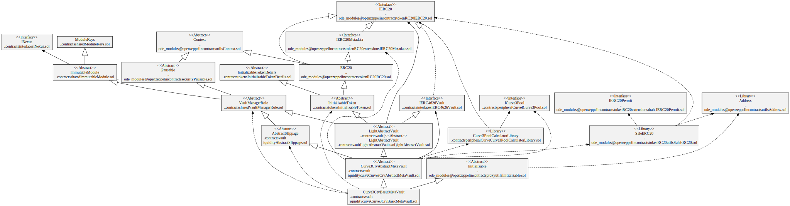

`Curve3CrvAbstractMetaVault`

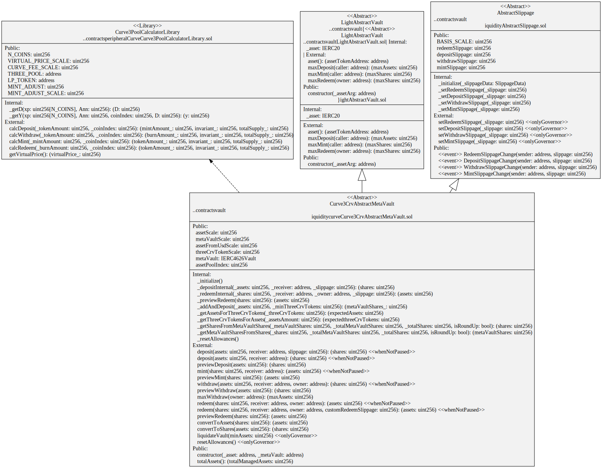

`Curve3CrvBasicMetaVault` storage

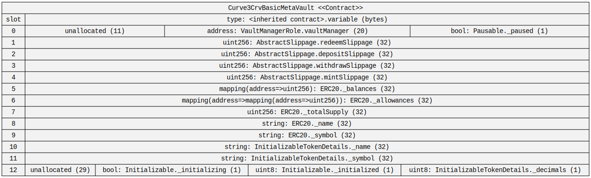

# Processes

The following processes are for the 3Pool-based vaults but the FRAX-based vaults functionally work the same.

## Total Assets

Get the total assets in USD in a `Curve3CrvAbstractMetaVault`.

Calculates the vault's total assets by extrapolating the asset tokens (DAI, USDC or USDT) received from redeeming one Curve 3Pool LP token (3Crv) by the amount of 3Crv in the underlying Meta Vault.
This takes into account Curve 3Pool token balances but does not take into account any slippage or fees.

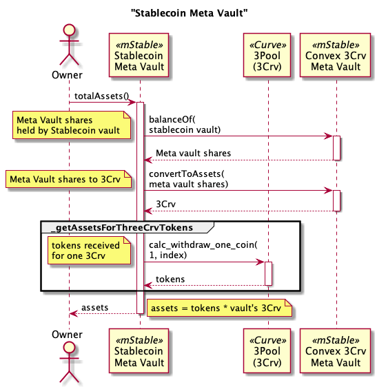

## Preview Deposit

Shareholder previews the number of shares returned from a deposit of assets (DAI) in a `Curve3CrvAbstractMetaVault`.

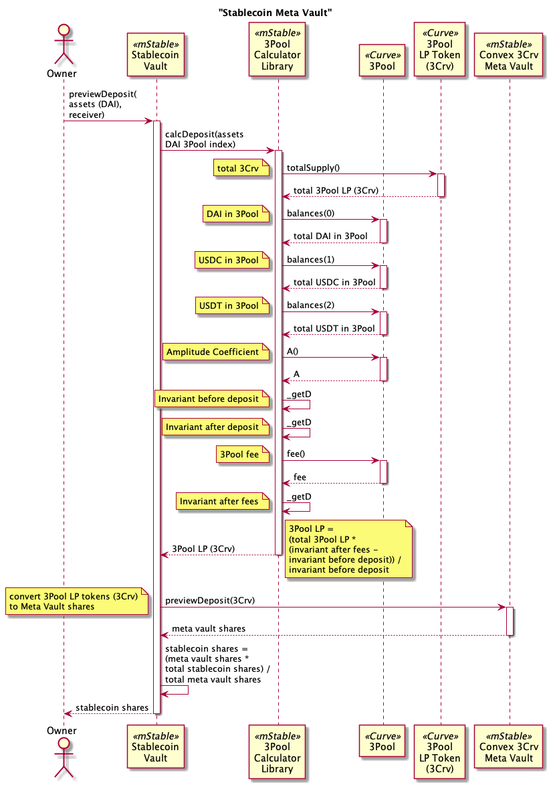

## Deposit

Shareholder deposits assets (DAI) into a `Curve3CrvAbstractMetaVault` for vault shares.

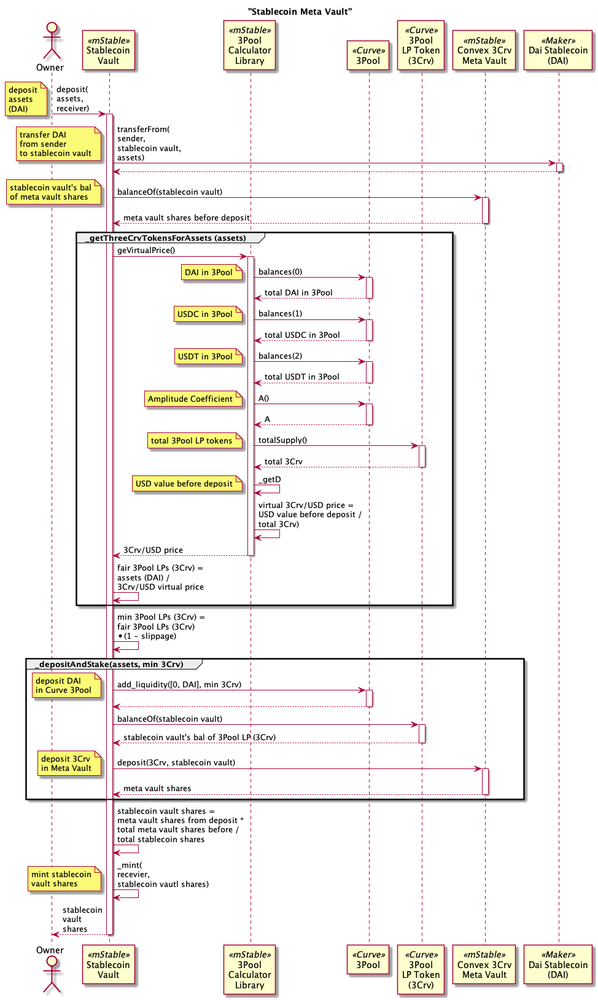

## Preview Mint

Shareholder previews the number of assets (DAI) required to deposit for an amount of vault share from a `Curve3CrvAbstractMetaVault`.

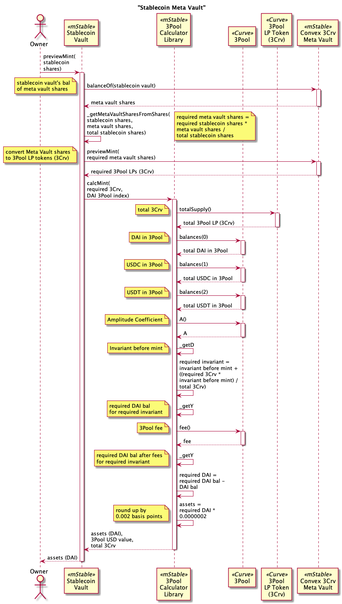

## Mint

Shareholder mints vault shares in exchange for assets (DAI) in a `Curve3CrvAbstractMetaVault`.

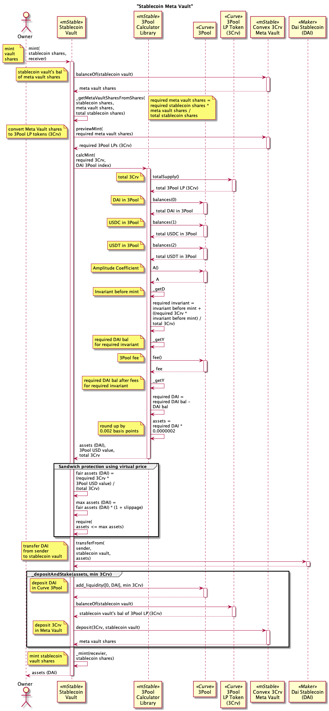

## Preview Withdraw

Shareholder previews the number of shares burned from a withdrawal of assets (DAI) in a `Curve3CrvAbstractMetaVault`.

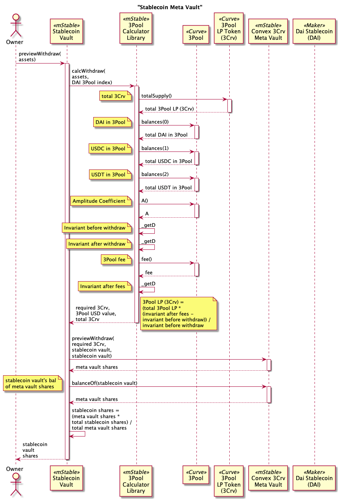

## Withdraw

Shareholder withdraws assets (DAI) from a `Curve3CrvAbstractMetaVault` for vault shares.


## Preview Redeem

Shareholder previews the number of assets (DAI) received for redeeming an amount of vault share from a `Curve3CrvAbstractMetaVault`.

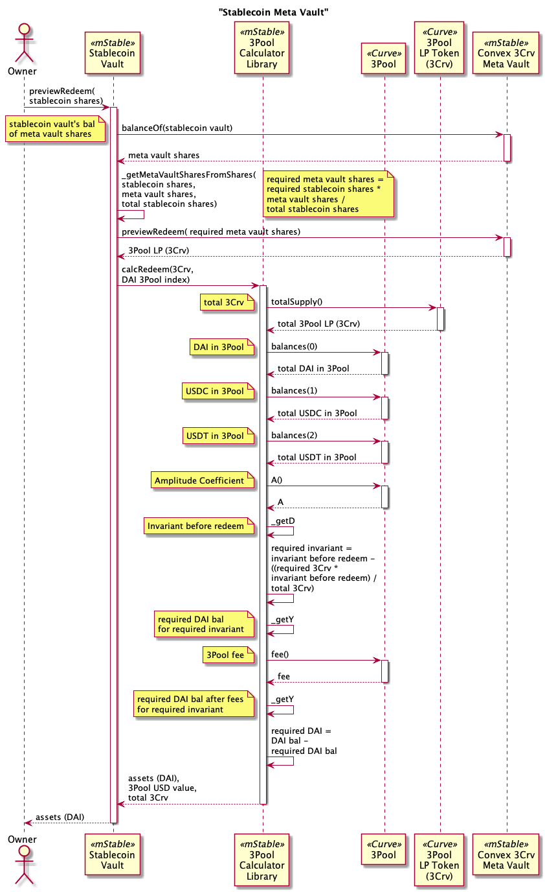

## Redeem

Shareholder redeems vault shares in exchange for assets (DAI) in a `Curve3CrvAbstractMetaVault`.

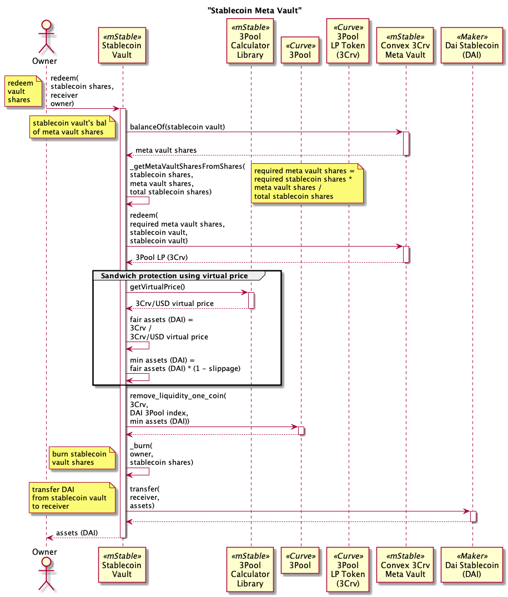

# Tests

Fork tests

```
export NODE_URL=your provider url
yarn test:file:fork ./test-fork/vault/Curve3CrvBasicMetaVault.test.ts
yarn test:file:fork ./test-fork/vault/CurveFraxBpBasicMetaVault.test.ts
```

