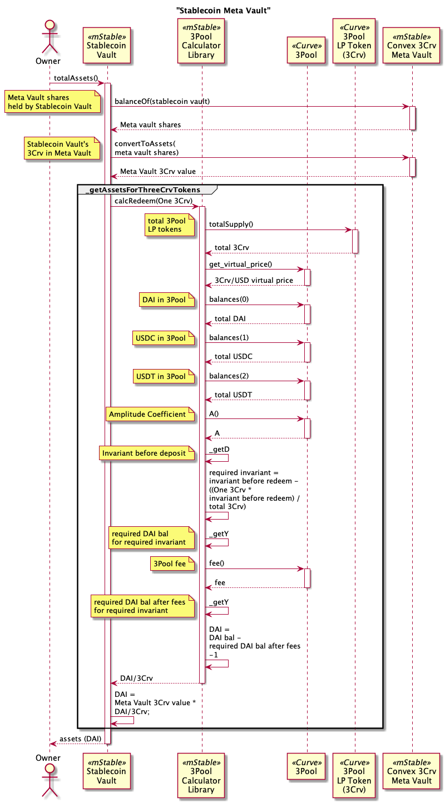

# Curve Liquidity Vaults

Provide liquidity to [Curve](https://curve.readthedocs.io/) pools.

# Contracts

-   [Curve3CrvAbstractMetaVault](./Curve3CrvAbstractMetaVault.sol) Abstract ERC-4626 vault with one of DAI/USDC/USDT asset invested in 3Pool, and then deposited in the Convex 3Crv Meta Vault.
-   [Curve3CrvBasicMetaVault](./Curve3CrvBasicMetaVault.sol) Basic implementation of Curve3CrvBasicMetaVault.

# Diagrams

## Stablecoin (DAI/USDC/USDT) Convex 3Crv Meta Vault

`Curve3CrvBasicMetaVault` hierarchy

`Curve3CrvAbstractMetaVault`

`Curve3CrvBasicMetaVault` storage

# Processes

## Total Assets

Get the total assets in USD in a `Curve3CrvAbstractMetaVault`.

Calculates the vault's total assets by extrapolating the asset tokens (DAI, USDC or USDT) received from redeeming one Curve 3Pool LP token (3Crv) by the amount of 3Crv in the underlying Meta Vault.
This takes into account Curve 3Pool token balances but does not take into account any slippage or fees.

Steps:

-   Get vault's balance of Curve 3Pool LP tokens (3Crv) in the underlying Meta Vault.
-   Get tokens (DAI, USDC or USDT) for removing one Crv token from the Curve 3Pool.
-   assets = tokens \* vault's 3Crv in the underlying Meta Vault.

## Preview Deposit

Shareholder previews the amount of shares returned from a deposit of assets (3Crv) in a `Curve3CrvAbstractMetaVault`.

Uses the Curve 3Pool virtual price to calculate the minimum shares from depositing an amount of assets using a configured max slippage.

