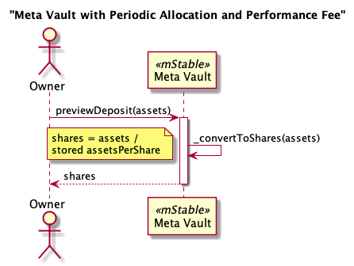
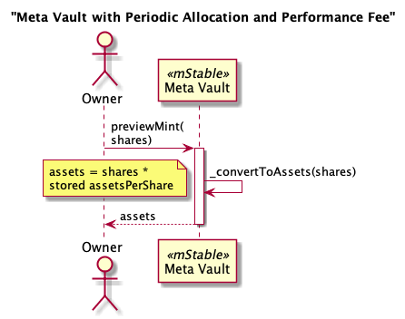
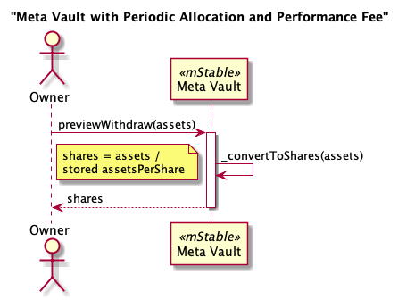
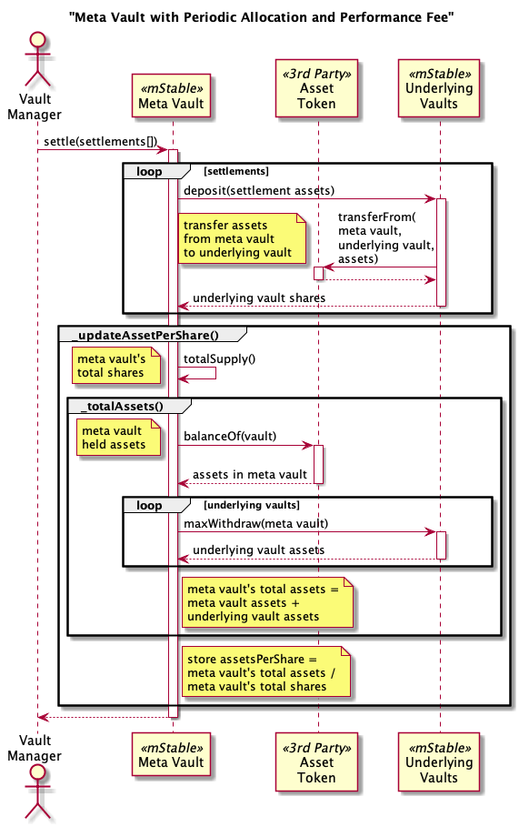
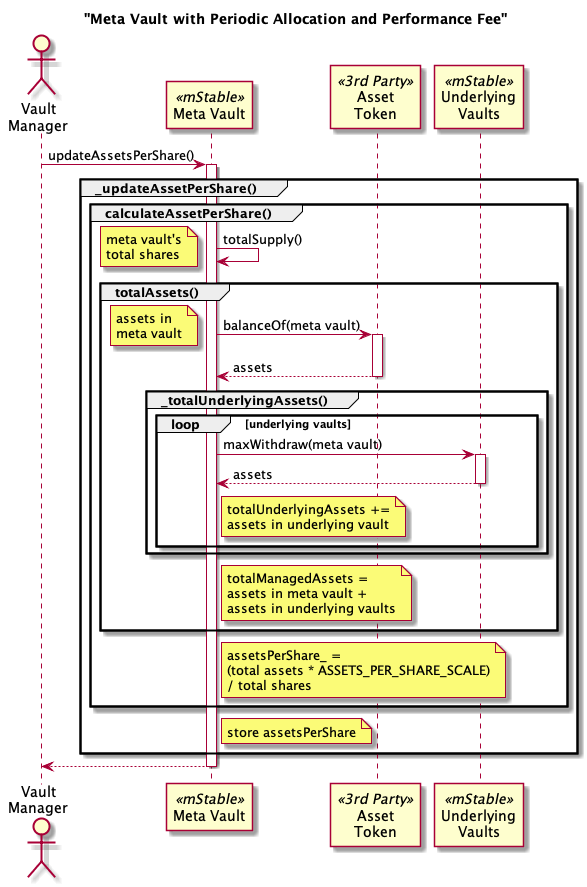
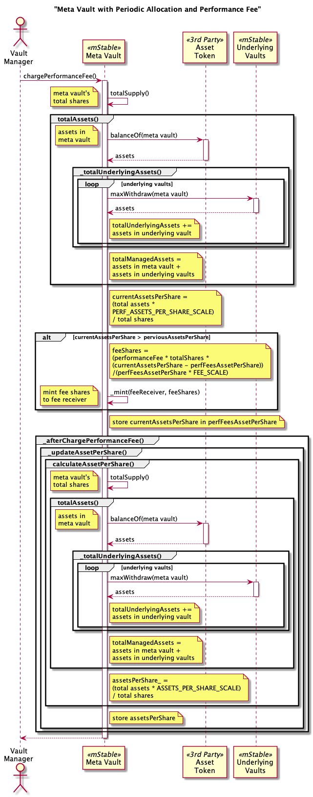

# Meta Vaults

A Meta Vault is composed of other ERC-4626 compliant vaults.

# Contracts

-   [PeriodicAllocationPerfFeeMetaVault](./PeriodicAllocationPerfFeeMetaVault.sol) EIP-4626 vault periodically invests deposited assets into the underlying vaults and charges a performance fee.

# Capabilities

## PeriodicAllocationPerfFeeMetaVault

* [ERC-4626](https://eips.ethereum.org/EIPS/eip-4626) compliant tokenized vault.
* [ERC-20](https://eips.ethereum.org/EIPS/eip-20) compliant token.
* Assets are invested across multiple underlying ERC-4626 vaults of the same asset type.
* Investment of deposited assets to the underlying vaults is batched in a `settle` process.
* `deposit` and `mint` use minimal gas as the investment is done separately.
* The `VaultManager` directs the deposited assets to the underlying vaults.
* Assets in underlying vaults can be redistributed by the `VaultManager`.
* Small withdrawals are taken from a single configured underlying vault to save gas.
* Large withdraws are proportionally taken from all underlying vaults.
* Performance fee periodically charged on assets per share increases.
* Vault operations are pausable by the `Governor`.
* Vault configuration is controlled by a protocol `Governor`. This includes:
    * Which underlying vaults are used.
    * Which vault small withdrawals are taken from.
    * The threshold for large withdraws as a percentage of shares.
    * Setting the account that receives the performance fee.
* One week time delay for proxy upgrades by the `Governor`.

See [Trusted Accounts](../../../TrustedAccounts.md) for more information about the `Governor` and `VaultManager`.

# Diagrams

## Meta Vault with Periodic Allocation and Performance Fee

`PeriodicAllocationPerfFeeMetaVault` contract hierarchy


`PeriodicAllocationPerfFeeMetaVault` contract


`PeriodicAllocationPerfFeeMetaVault` storage


# PeriodicAllocationPerfFeeMetaVault Processes

## Total Assets

Includes all the assets in this vault plus all the underlying vaults.
The amount of assets in each underlying vault is calculated using the share percentage of the underlying vault's total assets. This does not account for fees or slippage to the actual asset value is likely to be less.


## Preview Deposit

Uses the stored assets per share to convert deposited assets to minted vault shares.



## Deposit


## Preview Mint

Uses the stored assets per share to convert the requested minted shares to the required assets to be deposited.



## Mint


## Preview Withdraw



## Withdraw


## Preview Redeem


## Redeem


## Settle

The Vault Manager specifies the amounts of assets to be deposited into the underlying vaults. Not all the assets in the Meta Vault need to be deposited into the underlying vault. Some can be left as a cache for future withdrawals.
Not all the underlying vaults need to receive deposits. The Vault Manager may deposit to just one underlying vault. Or they may deposit to all the underlying vaults.
The amounts to each underlying vault can be different. It's at the discretion of the Vault Manager.

Note the Vault Manager may be an externally owned account that is controlled by an automated off-chain process. It could also be an on-chain contract. Or it could be a multi-signature wallet.



## Update Assets Per Share



## Charge Performance fee

Charges a performance fee by looking at the increase in assets per share since the last time a performance fee was charged. The fee is collected in vault shares which dilutes the assets per share of the vault share holders. For example, if the assets per share increased by 0.1% in the last week and the performance fee is 4%, the vault shares will be increased by 0.1% * 4% = 0.004% as a fee. If there was 100,000 vault shares, 4 (100,000 * 0.004%) vault shares will be minted as a performance fee. This dilutes the assets per shares of the existing vault shareholders by 0.004%.



# Tests


Fork tests

```
export NODE_URL=your provider url
export DEBUG=mstable:*
yarn test:file:fork ./test-fork/vault/savePlus.spec.ts
```
