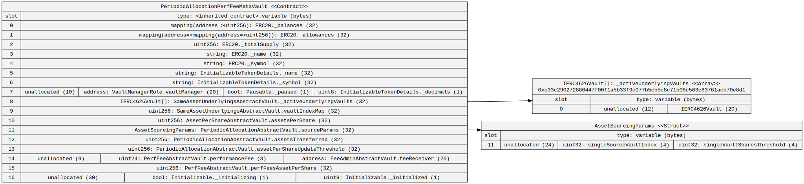
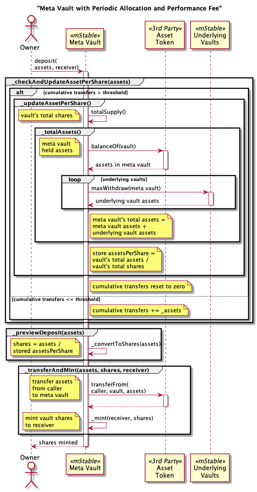
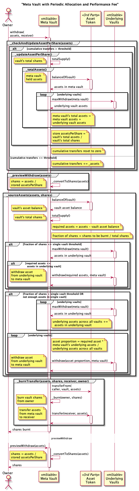

# Meta Vaults

A Meta Vault is composed of other ERC-4626 compliant vaults.

# Contracts

-   [PeriodicAllocationPerfFeeMetaVault](./PeriodicAllocationPerfFeeMetaVault.sol) EIP-4626 vault periodically invests deposited assets into the underlying vaults and charges a performance fee.

# Capabilities

## PeriodicAllocationPerfFeeMetaVault

* [ERC-4626](https://eips.ethereum.org/EIPS/eip-4626) compliant tokenized vault.
* [ERC-20](https://eips.ethereum.org/EIPS/eip-20) compliant token.
* Assets are invested across multiple underlying ERC-4626 vaults of the same asset type.
* Investment of deposited assets to the underlying vaults is batched in a `settle` process.
* `deposit` and `mint` use minimal gas as the investment is done separately.
* The `VaultManager` directs the deposited assets to the underlying vaults.
* Assets in underlying vaults can be redistributed by the `VaultManager`.
* Small withdrawals are taken from a single configured underlying vault to save gas.
* Large withdraws are proportionally taken from all underlying vaults.
* Performance fee periodically charged on assets per share increases.
* Vault configuration is controlled by a protocol `Governor`. This includes:
    * Which underlying vaults are used.
    * Which vault small withdrawals are taken from.
    * The threshold for large withdraws as a percentage of shares.
* Vault operations are pausable by the `Governor`.
* One week time delay for proxy upgrades by the `Governor`.

# Diagrams

## Meta Vault with Periodic Allocation and Performance Fee

`PeriodicAllocationPerfFeeMetaVault` contract hierarchy


`PeriodicAllocationPerfFeeMetaVault` contract


`PeriodicAllocationPerfFeeMetaVault` storage



# PeriodicAllocationPerfFeeMetaVault Processes

## Total Assets

Includes all the assets in this vault plus all the underlying vaults.
The amount of assets in each underlying vault is calculated using the share percentage of the underlying vault's total assets. This does not account for fees or slippage to the actual asset value is likely to be less.


## Deposit



## Mint


## Withdraw



## Redeem


## Settle

## Update Assets Per Share


## Rebalance


# Tests


Fork tests

```
export NODE_URL=your provider url
yarn test:file:fork ./test-fork/vault/Convex3CrvMetavault.spec.ts
yarn test:file:fork ./test-fork/vault/savePlus.spec.ts
```
