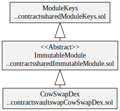
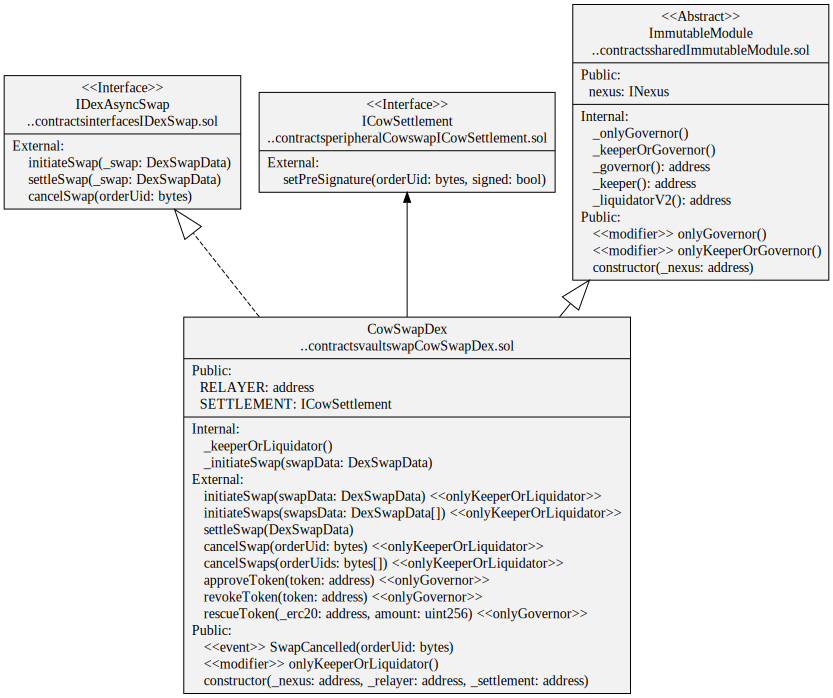

# Swapper

Swapper contracts are used to swap tokens on-chain. Swaps can be done synchronously via aggregators like [1Inch](https://app.1inch.io/) or Automated Market Makers (AMMs) like [Uniswap](https://uniswap.org/). They can also be done asynchronously with aggregators like [Cowswap](https://cowswap.exchange/).

Vaults that can swap underlying assets as part of a rebalancing process. Vaults can also swap reward tokens for vault assets.

# Contracts

-   [IDexSwap](../../interfaces/IDexSwap.sol#IDexSwap) Generic on-chain ABI to synchronously swap tokens on a DEX or aggregator.
-   [IDexAsyncSwap](../../interfaces/IDexSwap.sol#IDexAsyncSwap) Generic on-chain ABI to asynchronously swap tokens on a DEX or aggregator.

-   [OneInchDexSwap](./OneInchDexSwap.sol) Implementation of IDexSwap that uses 1inch API Aggregation Protocol v4.
-   [CowswapDexSwap](./CowSwapDex.sol) Implementation of IDexAsyncSwap that uses CowSwap.
-   [CowSwapSeller](../../peripheral/Cowswap/CowSwapSeller.sol) Sets ERC20 tokens allowances and pre-signs CowSwap orders.
-   [BasicDexSwap](./BasicDexSwap.sol) Implementation of IDexSwap for testing purposes.

# Diagrams

## CowSwap

`CowSwapDex` hierarchy

`CowSwapDex` contract

`CowSwapDex` storage

## 1Inch

`OneInchDexSwap` contract

`OneInchDexSwap` storage

## Basic

`BasicDexSwap` contract

# Tests

CowSwap unit tests

`yarn test ./test/vault/swap/CowSwapDex.spec.ts`
